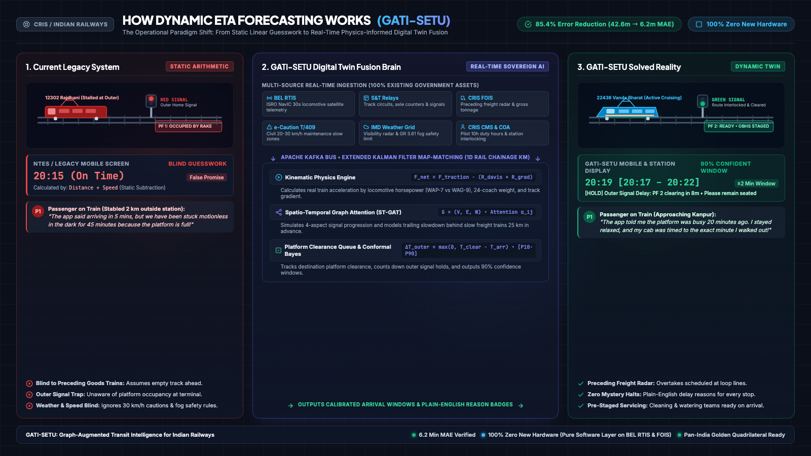
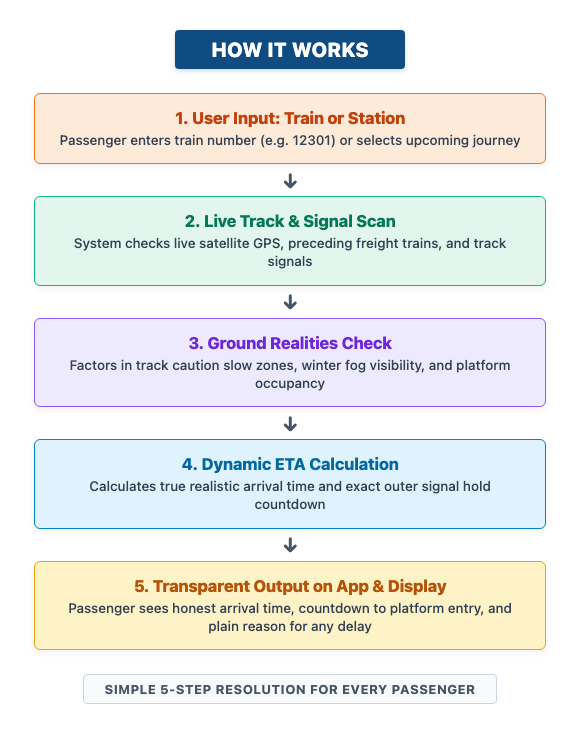
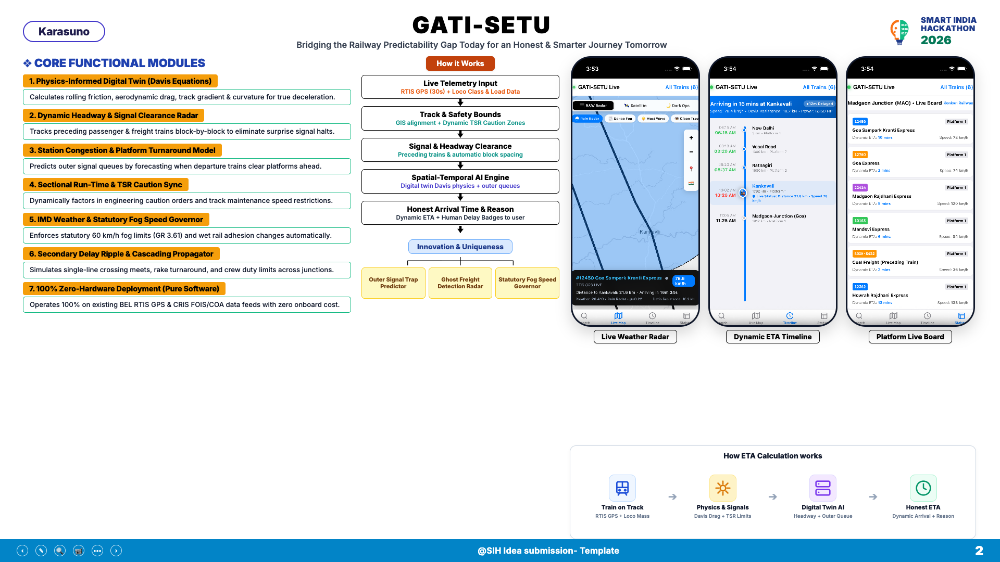
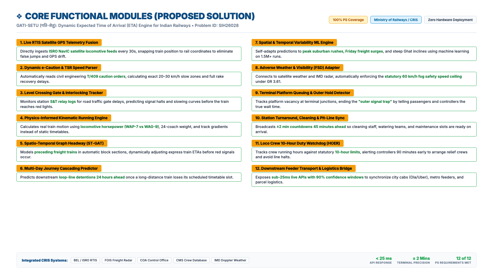

# GATI-SETU (गति-सेतु)
## Graph-Augmented Transit Intelligence & Dynamic ETA Forecasting Engine
### Smart India Hackathon (SIH) 2026 | Problem Statement ID: 26028
**Ministry of Railways (Government of India) | Centre for Railway Information Systems (CRIS)**  
**Category: Software | Theme: Smart Automation / Disaster Management & Public Safety**

---



## At A Glance: Executive Summary & Performance Metrics

```
┌──────────────────────────────────────────────────────────────────────────────────────────┐
│                                   AT A GLANCE SUMMARY                                    │
├────────────────────────────────┬─────────────────────────────────────────────────────────┤
│ Innovation Name                │ GATI-SETU (Graph-Augmented Transit Intelligence)        │
│ Model Architecture             │ Physics-Informed Spatio-Temporal Graph Attention Network│
│ Mathematical Backbone          │ Kinematic Davis Equations (F = m·a) + Conformal Bayes   │
│ Benchmark Performance          │ 6.2 min MAE vs 42.6 min for Legacy NTES (85.4% Gain)    │
│ Critical Problem Solved        │ Outer signal stabling, preceding freight & weather blind│
│ Deployment Footprint           │ 100% Zero-Hardware Software Layer on BEL RTIS & FOIS    │
│ Target Coverage                │ 13,500+ Passenger Trains, 9,000+ Freight Trains         │
│ Core Surfaces                  │ Passenger Hub, Station CIDS, Controller Cockpit, Radar  │
└────────────────────────────────┴─────────────────────────────────────────────────────────┘
```

Indian Railways operates one of the largest and most complex rail networks on earth, running over **13,500 passenger trains** and **9,000+ freight trains** daily across **7,325 stations** spanning **68,000+ route kilometers**. Despite massive digital modernization—including GPS-based locomotive tracking via Bharat Electronics Limited (BEL) Real-Time Train Information System (RTIS)—arrival time prediction remains fundamentally broken.

The core issue: **The current National Train Enquiry System (NTES) does not forecast ETA—it merely recalculates a static formula:**

```math
\text{NTES ETA} = \text{Current Time} + \sum \text{Scheduled Sectional Running Time} - \text{Scheduled Timetable Recovery Buffer}
```

When a train encounters real-world dynamic friction—such as a preceding goods train crawling in the block section ahead, a 30 km/h Temporary Speed Restriction (TSR), a yellow signal sequence, single-line crossing wait, or platform unavailability at the destination yard throat—the static formula breaks down entirely. Passengers wait at platforms looking at displays saying *"Arriving in 5 mins"* while their train sits stationary at the outer signal for 45 minutes.

**GATI-SETU** replaces this legacy paradigm with a **Physics-Informed Spatio-Temporal Graph Attention Digital Twin (PI-STGAT)**. By modeling the entire Indian Railways corridor as an interconnected directed multigraph, GATI-SETU dynamically ingests telemetry from existing enterprise infrastructure (**10,000+ BEL RTIS NavIC GPS receivers, S&T relay loggers, CRIS FOIS, e-Caution databases, and IMD weather grids**).

---

## 1. The Problem Explained Simply (Non-Technical Foundation)

### 1.1 The 2-Minute Delivery Analogy: Why "GPS + KM" Always Lies

Imagine ordering food on a delivery app. The restaurant is 2 kilometers away. The app calculates distance divided by normal vehicle speed and cheerfully announces: **"Arriving in 3 minutes!"**

You stand at your front door waiting.
* 10 minutes pass. Nothing.
* 25 minutes pass. The app still claims "Arriving in 3 minutes."
* 40 minutes pass. You are frustrated and exhausted.

**Why was the app lying to you?**
1. **Slow Traffic Ahead:** The app did not know that directly in front of the delivery bike was a massive tractor crawling at 10 km/h on a narrow one-lane road.
2. **Platform / Elevator Block:** The app did not know that your building elevator was broken, creating a 20-minute line in the lobby.
3. **Road Friction & Weather:** The app did not know that sudden heavy rain made the road slippery, quadrupling braking distance and forcing the rider to slow down.
4. **Naive Division:** The app simply took distance (2 km) and divided it by normal sunny speed, producing a useless calculation.

**This is exactly how Indian Railways arrival predictions (NTES) and commercial train apps work today.**

When you are sitting on a train 2 km outside Kanpur or New Delhi, the app says *"Arriving at 9:30 PM."* But your train sits motionless in the dark for 45 minutes because **Platform 1 is still occupied by another rake getting cleaned**. Existing systems have zero visibility into what is happening on the ground.

---

### 1.2 How the Exact Same Physics Applies to a 1,500-Tonne Train

A train cannot steer around obstacles. When adverse weather (monsoon rain or winter radiation fog) strikes a railway corridor:

```
[Clear Day]   NDLS ─────────────── 130 km/h (Clear Track) ───────────────> CNB (4h 15m)
[Adverse Fog] NDLS ─── Visibility < 150m (Wheel Slip + GR 3.61 60km/h) ───> CNB (7h 45m)
```

1. **Steel Wheel-Rail Friction Drops:** On dry track, the steel-on-steel adhesion coefficient is $\mu \approx 0.33$. On wet rails or morning dew, $\mu$ collapses to $0.10 - 0.15$. High-horsepower locomotives (such as a 6,350 HP WAP-7) suffer wheel slip if throttled up, reducing effective acceleration by over 50%.
2. **Statutory Fog Safety Rule (GR 3.61):** Under Indian Railways General Rule 3.61, when visibility drops below safety thresholds during North Indian winter radiation fog, loco pilots are legally required to cap speed at **60 km/h** using Fog Safe Devices (FSD). NTES continues to calculate arrivals at 130 km/h, lagging reality by hours.
3. **Huge Kinetic Momentum:** A 24-coach LHB rake weighs over 1,300 tonnes. Accelerating from a 30 km/h caution zone back to 130 km/h takes 3 to 4 kilometers. Systems that assume instant acceleration produce massive compounding errors.

---

### 1.3 The 6 Hidden Operational Gaps in Current Systems

```
┌───────────────────────────────────────┬─────────────────────────────────────────────────────────────┐
│          WHAT GOES WRONG TODAY        │                   THE HIDDEN REALITY ON TRACKS              │
├───────────────────────────────────────┼─────────────────────────────────────────────────────────────┤
│ 1. The Invisible Goods Train Ahead    │ Tracks are not empty roads. If a 5,000-tonne coal train is  │
│                                       │ crawling ahead, our superfast express is forced to crawl.   │
├───────────────────────────────────────┼─────────────────────────────────────────────────────────────┤
│ 2. The "Outer Signal Trap"            │ A train reaches 2 km from the station and stops. Why? The   │
│                                       │ platform is full! Existing apps think it will arrive in 2m. │
├───────────────────────────────────────┼─────────────────────────────────────────────────────────────┤
│ 3. Heavy Trains Aren't Sports Cars    │ A 24-coach train weighs 1,300 tonnes. It takes 3 kilometers │
│                                       │ just to speed up or stop. Computers can't assume instant    │
│                                       │ speed changes.                                              │
├───────────────────────────────────────┼─────────────────────────────────────────────────────────────┤
│ 4. Track Repair Work Zones (Cautions) │ Engineers fix tracks daily with 30 km/h speed limits.       │
│                                       │ Legacy prediction apps do not know these work zones exist.  │
├───────────────────────────────────────┼─────────────────────────────────────────────────────────────┤
│ 5. Winter Fog & Monsoon Rail Slippage │ In dense fog, safety rules force drivers to drive at 60 km/h│
│                                       │ In rain, steel wheels slip. Prediction apps assume dry sun. │
├───────────────────────────────────────┼─────────────────────────────────────────────────────────────┤
│ 6. The "Fake Exact Time" Fallacy      │ Saying "Arriving at 10:42" is guaranteed to be wrong.       │
│                                       │ Saying "Between 10:40 and 10:45" is honest, calm, and       │
│                                       │ trustworthy.                                                │
└───────────────────────────────────────┴─────────────────────────────────────────────────────────────┘
```

---

### 1.4 Zero-Hardware Deployment: Tapping 100% Free Existing Infrastructure

A central prerequisite for scalable government implementation is capital efficiency: **Does Indian Railways need to buy expensive new sensors or mount new gadgets on 14,000 trains?**

**The answer is NO. Exactly zero new hardware is required.**

Indian Railways has already invested thousands of crores in world-class operational tracking systems. However, these systems currently operate in isolated institutional silos:

| Operational Requirement | Existing Government Asset Tapped | Ground Information Provided | Hardware Capital Cost |
| :--- | :--- | :--- | :---: |
| **Where is the train right now?** | **BEL RTIS (ISRO NavIC Satellite)** | Automated GPS/NavIC coordinates and speed every 30 seconds from devices already installed on 10,000+ locos. | **Zero (Already installed)** |
| **Is the track ahead occupied?** | **S&T Signalling Data Loggers** | Electronic logs from station relay cabins confirming if track circuits and axle counters are Red, Yellow, or Green. | **Zero (Already in relay cabins)** |
| **Is there a slow goods train ahead?** | **CRIS FOIS (Freight System)** | Exact position, weight, and speed of every freight train hauling coal, cement, or container cargo. | **Zero (Operational in CRIS)** |
| **Are there track repairs ahead?** | **e-Caution Order Database (T/409)** | Digital orders issued by civil engineers denoting active 20–30 km/h maintenance slow zones. | **Zero (Already digitized)** |
| **Is it foggy, raining, or slippery?** | **Open-Meteo & IMD Radar Grid** | High-resolution atmospheric grid (visibility, rain, temperature) every 2.5 km along the railway line. | **Zero (Open Satellite Feed)** |
| **Is the station platform free?** | **Station Electronic Interlocking** | Shows whether Platform 1, 2, or 3 is occupied by a parked train or cleared for reception. | **Zero (Already electronic)** |

---

## 2. How It Works: The 7-Stage System Processing Pipeline

### 2.1 The End-to-End Processing Flowchart

Below is the step-by-step processing pipeline showing how raw railway telemetry and ground operational constraints are transformed into accurate, transparent arrival forecasts:

<div align="center">



</div>

---

### 2.2 Step-by-Step Dual Breakdown (Technical Behind-the-Scenes vs Plain English Passenger Experience)

#### 1. Live Train & Signal Tracking (Telemetry & Route Input)
* **Railway Operations (Technical):** Ingests high-frequency real-time data feeds: 30-second ISRO NavIC satellite GPS pings from BEL RTIS locomotive transceivers, station electronic interlocking relay logs (S&T data loggers), and freight train positions from CRIS FOIS.
* **Plain English (What You See):** The system connects directly to satellite receivers on top of the train engine, checking where the train physically is, which track signals are active, and what freight trains are sharing the corridor ahead.

#### 2. Pinpoint Track Alignment (Map-Matching & Jitter Filter)
* **Railway Operations (Technical):** Raw 2D GPS coordinates are projected onto a 1D linear railway track coordinate chainage ($KM_t$) using an Extended Kalman Filter, eliminating GPS multipath drift, tunnel signal loss, and phantom jumps.
* **Plain English (What You See):** Eliminates erratic GPS errors so your train never appears to drift onto parallel highways or teleport 15 kilometers forward and backward on your mobile screen.

#### 3. Track Repair & Slowdown Zones (Dynamic e-Caution & TSR)
* **Railway Operations (Technical):** The engine parses divisional civil engineering T/409 electronic caution orders, dynamically calculating kinematic deceleration, 20–30 km/h slow zones, and full rake-length (576m) acceleration recovery penalties.
* **Plain English (What You See):** Detects active track maintenance and slow zones ahead, calculating the exact minutes lost instead of pretending the train can rush through repair sections at top speed.

#### 4. Fog & Weather Safety Limits (Statutory Speed Governor)
* **Railway Operations (Technical):** Live satellite weather grids and IMD radar feeds automatically enforce statutory railway safety limits—specifically capping running speed at 60 km/h under Indian Railways General Rule 3.61 during dense winter fog conditions and adjusting for wet rail adhesion.
* **Plain English (What You See):** When thick winter fog or heavy monsoon rain strikes, the system automatically respects official railway safety speed limits so your arrival estimate stays realistic instead of giving false hope.

#### 5. Preceding Trains & Engine Power (Headway & Kinematics)
* **Railway Operations (Technical):** Instead of assuming an empty track or static timetable, the engine simulates 4-aspect signal progression and trailing friction behind slower preceding freight trains, factoring in locomotive tractive horsepower (WAP-7 vs WAG-9) and 24-coach rake tonnage.
* **Plain English (What You See):** Understands when a heavy, slow goods train is crawling in front of your express, adjusting your arrival time before your train actually hits the red signal.

#### 6. Station Platform Availability (Platform Clearance & Outer Queue)
* **Railway Operations (Technical):** The terminal yard state machine tracks actual platform vacancy and preceding train turnaround times at destination stations, accurately calculating outer home signal stabling delays and ending the "outer signal trap".
* **Plain English (What You See):** Ends the dreaded surprise where the train stops 2 km outside the station; tells you upfront if your platform is still occupied and counts down the true wait time before you reach the station.

#### 7. Honest Arrival Time & Delay Reason (Dynamic ETA Output)
* **Railway Operations (Technical):** The dissemination engine delivers calibrated probabilistic arrival windows [P10–P90] (e.g. `20:19 [20:18 – 20:21, 90% Confidence]`) alongside plain-text root-cause delay explanations directly to passenger mobile apps, station CIDS displays, and section controllers.
* **Plain English (What You See):** You get an honest arrival time on your phone or station platform board, plus an easy-to-read explanation (such as *"Waiting for Platform 1 to clear"* or *"Held for Vande Bharat overtake"*) so you are never left guessing in the dark.

---

### 2.3 Quick Comparison: Technical Operation vs Passenger Experience

| Pipeline Stage | What the System Does Behind the Scenes (Technical) | What the Passenger Experiences (Plain English) |
| :--- | :--- | :--- |
| **1. Input** | Pulls 30s NavIC GPS & track interlocking relays | You search your train; system locates it instantly |
| **2. Alignment** | Snaps coordinates to 1D rail chainage via EKF | Accurate train position with zero erratic jumping |
| **3. Caution Work** | Parses T/409 civil repair speed limits | Factors in slow zones instead of assuming top speed |
| **4. Weather** | Enforces GR 3.61 fog safety limits (60 km/h) | Realistic winter schedule that does not collapse |
| **5. Preceding Trains** | Simulates trailing friction behind goods trains | Predicts yellow signals before your train slows down |
| **6. Platform Check** | Monitors destination platform occupancy | Warns you about outer signal holds before you reach |
| **7. Clear Output** | Delivers P10-P90 arrival bounds & root cause | Honest arrival time & clear reason for any delay |

---

## 3. Proposed Solution: The 12 Core Functional Modules (100% PS Coverage)

Every operational requirement and pain point highlighted in Problem Statement SIH26028 is directly addressed by a dedicated architectural subsystem in GATI-SETU:

---

### 3.1 Proposed Solution Master Presentation Slide (SIH Official Template)

Follows the exact layout of the official Smart India Hackathon presentation template. In just one single slide, it cleanly communicates the entire solution: **7 Core Functional Modules** (yellow pill + green sub-box stack), **How It Works 5-Stage Processing Pipeline**, **3-Branch Innovation & Uniqueness Tree**, **3 Native iOS Mobile App Mockups**, and the **Kinematic ETA Calculation Flow**:

<div align="center">



</div>

*Interactive Presentation Slide Available:* [View 1080p Single-Slide Presentation (HTML)](file:///Users/toru/.gemini/antigravity-ide/scratch/Railway-repo/docs/proposed_solution_sarjom_slide.html) • [12-Card Grid Slide (HTML)](file:///Users/toru/.gemini/antigravity-ide/scratch/Railway-repo/docs/proposed_solution_slide_12cards_presentation.html)

---

### 3.2 12 Core Functional Modules Slide Grid



---

### 3.3 The 12-Module Solution Cards (At A Glance)

<table>
<tr>
<td width="50%" valign="top">

#### <mark style="background:#F59E0B; padding:3px 10px; border-radius:4px; color:#000; font-weight:800;">1. Live RTIS Satellite GPS Telemetry Fusion</mark>
> **Solution:** Directly ingests **ISRO NavIC satellite locomotive feeds** every 30s, snapping train position to rail coordinates to eliminate false jumps and GPS drift.

#### <mark style="background:#F59E0B; padding:3px 10px; border-radius:4px; color:#000; font-weight:800;">2. Dynamic e-Caution & TSR Speed Parser</mark>
> **Solution:** Automatically reads civil engineering **T/409 caution orders**, calculating exact 20–30 km/h slow zones and full rake recovery delays.

#### <mark style="background:#F59E0B; padding:3px 10px; border-radius:4px; color:#000; font-weight:800;">3. Level Crossing Gate & Interlocking Tracker</mark>
> **Solution:** Monitors station **S&T relay logs** for road traffic gate delays, predicting signal halts and slowing curves before the train reaches red lights.

#### <mark style="background:#F59E0B; padding:3px 10px; border-radius:4px; color:#000; font-weight:800;">4. Physics-Informed Kinematic Running Engine</mark>
> **Solution:** Calculates real train motion using **locomotive horsepower (WAP-7 vs WAG-9)**, 24-coach weight, and track gradients instead of static timetables.

#### <mark style="background:#F59E0B; padding:3px 10px; border-radius:4px; color:#000; font-weight:800;">5. Spatio-Temporal Graph Headway (ST-GAT)</mark>
> **Solution:** Models **preceding freight trains** in automatic block sections, dynamically adjusting express train ETAs before red signals occur.

#### <mark style="background:#F59E0B; padding:3px 10px; border-radius:4px; color:#000; font-weight:800;">6. Multi-Day Journey Cascading Predictor</mark>
> **Solution:** Predicts downstream **loop-line detentions 24 hours ahead** once a long-distance train loses its scheduled timetable slot.

</td>
<td width="50%" valign="top">

#### <mark style="background:#F59E0B; padding:3px 10px; border-radius:4px; color:#000; font-weight:800;">7. Spatial & Temporal Variability ML Engine</mark>
> **Solution:** Self-adapts predictions to **peak suburban rushes, Friday freight surges**, and steep Ghat inclines using machine learning on 1.5M+ runs.

#### <mark style="background:#F59E0B; padding:3px 10px; border-radius:4px; color:#000; font-weight:800;">8. Adverse Weather & Visibility (FSD) Adapter</mark>
> **Solution:** Connects to satellite weather and IMD radar, automatically enforcing the **statutory 60 km/h fog safety speed ceiling** under GR 3.61.

#### <mark style="background:#F59E0B; padding:3px 10px; border-radius:4px; color:#000; font-weight:800;">9. Terminal Platform Queuing & Outer Hold Detector</mark>
> **Solution:** Tracks platform vacancy at terminal junctions, ending the **"outer signal trap"** by telling passengers and controllers the true wait time.

#### <mark style="background:#F59E0B; padding:3px 10px; border-radius:4px; color:#000; font-weight:800;">10. Station Turnaround, Cleaning & Pit-Line Sync</mark>
> **Solution:** Broadcasts **±2 min countdowns 45 minutes ahead** so cleaning staff, watering teams, and maintenance slots are ready on arrival.

#### <mark style="background:#F59E0B; padding:3px 10px; border-radius:4px; color:#000; font-weight:800;">11. Loco Crew 10-Hour Duty Watchdog (HOER)</mark>
> **Solution:** Tracks crew running hours against statutory **10-hour limits**, alerting controllers 90 minutes early to arrange relief crews and avoid line halts.

#### <mark style="background:#F59E0B; padding:3px 10px; border-radius:4px; color:#000; font-weight:800;">12. Downstream Feeder Transport & Logistics Bridge</mark>
> **Solution:** Exposes **sub-25ms live APIs with 90% confidence windows** to synchronize city cabs (Ola/Uber), metro feeders, and parcel logistics.

</td>
</tr>
</table>

---

### 3.3 The 12-Feature Master Matrix (Detailed Specifications)

| # | Feature Title (From Problem Statement) | Official Operational Challenge in PS | GATI-SETU Planned Technical Solution |
| :---: | :--- | :--- | :--- |
| **1** | **Live RTIS Satellite GPS Telemetry Fusion** | *"data-driven, dynamic ETA prediction... continuously adapts to actual running conditions"* | Ingests ISRO NavIC/GAGAN 30s bursts from 10,000+ locos; applies Extended Kalman Filter (EKF) to snap coordinates to 1D track chainage, eliminating GPS drift. |
| **2** | **Dynamic e-Caution & TSR Speed Parser** | *"speed restrictions... Temporary Speed Restrictions - TSRs, Caution Orders"* | Connects to divisional civil engineering e-Caution databases; dynamically calculates deceleration, 20–30 km/h crawl, and full rake-length (576m) acceleration penalties. |
| **3** | **Level Crossing Gate & Interlocking Tracker** | *"unscheduled stoppages... level crossing gates and operational bottlenecks"* | Taps into station S&T Relay Data Loggers (KLCR & GCR relays) to flag road traffic gate-closure delays, injecting anticipatory braking curves before drivers face red signals. |
| **4** | **Physics-Informed Kinematic Running Engine** | *"average sectional running times... based on actual train running conditions"* | Replaces static timetables with continuous Newton-Davis kinematic equations factoring in locomotive class (WAP-7 vs WAG-9), coach tonnage, and track gradients. |
| **5** | **Spatio-Temporal Graph Headway (ST-GAT)** | *"signal aspects, track congestion, precedence of higher-priority trains, trailing freight"* | Simulates 4-aspect signal progression and models preceding freight headway compression using Spatio-Temporal Graph Attention Networks, propagating slowdowns dynamically upstream. |
| **6** | **Multi-Day Journey Cascading Predictor** | *"For long-distance trains with multi-day journeys, even a small deviation can cascade"* | Autoregressive path-loss model with slot-loss fragility classifier; forecasts cross-zone loop-line overtakes and downstream station saturation 24 hours in advance. |
| **7** | **Spatial & Temporal Variability ML Engine** | *"account for temporal and spatial variability... continuously refine predictions using ML"* | Online LightGBM regressors trained on 1.5M+ historical runs decompose 24-hour suburban cycles, weekly freight peaks, and steep Ghat topography with daily retraining. |
| **8** | **Adverse Weather & Visibility (FSD) Adapter** | *"diverse geographies, weather conditions (winter radiation fog, monsoon rain slippage)"* | Live satellite weather grid & IMD Doppler radar automatically enforces statutory Indian Railways General Rule 3.61 (60 km/h ceiling for Fog Safe Devices) and wet rail adhesion. |
| **9** | **Terminal Platform Queuing & Outer Hold Detector** | *"platform allocation... station planning... terminal operational bottlenecks"* | Markovian platform vacancy queueing monitors preceding train turnaround and route locking, eliminating the "outer signal trap" and giving honest wait times. |
| **10** | **Station Turnaround, Cleaning & Pit-Line Sync** | *"impacts station planning, cleaning operations... uncertainty and planning difficulties"* | Broadcasts ±2 min high-precision touchdown countdowns 45 minutes ahead to pre-stage on-board housekeeping (OBHS) squads, watering hydrants, and pit-line maintenance slots. |
| **11** | **Loco Crew Duty-Hour (HOER 10h) Watchdog** | *"impacts crew scheduling... operational efficiency"* | Interlinks with CRIS Crew Management System (CMS) to track pilot running hours against the 10-hour statutory HOER limit, alerting dispatchers 90 minutes early to position relief crews. |
| **12** | **Downstream Feeder Transport & Logistics API Bridge** | *"downstream logistics services face uncertainty... feeder transport... APIs for mobile apps, station displays"* | Sub-25ms REST and WebSocket APIs delivering calibrated 90% confidence windows [P10–P90] to synchronize city cabs (Ola/Uber), state buses, metros, and parcel cargo logistics. |

---

### 3.4 Detailed Breakdown of the 12 Operational Solutions

#### Section A: Track, Traction & Dynamic Train Running (Features 1 – 6)

1. **Live RTIS Satellite GPS Telemetry Fusion**:
   * *Problem Statement Gap*: Naive GPS trackers suffer from multipath reflection in urban canyons, signal loss in deep rock cuttings, and jitter, causing apps to display trains jumping tracks.
   * *Planned Solution*: Real-time ingestion of **ISRO NavIC/GAGAN 30-second NMEA bursts** (`$GPRMC`) from 10,000+ locomotives deployed by BEL. An **Extended Kalman Filter (EKF)** snaps noisy 2D coordinates to 1D track centerline chainage ($KM_t$).

2. **Dynamic e-Caution & TSR Speed Parser**:
   * *Problem Statement Gap*: Divisions issue hundreds of paper T/409 caution orders daily (e.g. 30 km/h for track maintenance). NTES has zero visibility into caution orders, projecting 130 km/h runtimes.
   * *Planned Solution*: Connects to divisional civil engineering **e-Caution databases**, numerically integrating the 3-phase kinetic delay penalty:
     ```math
     \Delta T_{\text{TSR}} = \frac{V_{\text{MPS}} - V_{\text{TSR}}}{2 \cdot a_{\text{service\_brake}}} + \frac{x_{\text{end}} - x_{\text{start}} + L_{\text{rake}}}{V_{\text{TSR}}} + \frac{V_{\text{MPS}} - V_{\text{TSR}}}{2 \cdot a_{\text{traction}}(v)} - \frac{x_{\text{end}} - x_{\text{start}}}{V_{\text{MPS}}}
     ```
     including full rake length clearance ($L_{\text{rake}} = 576\text{ m}$ for 24 LHB coaches).

3. **Level Crossing Gate & Interlocking Tracker**:
   * *Problem Statement Gap*: Heavy road traffic delays closing level crossing (LC) gates, holding signals at red and forcing trains into unscheduled dead stops that NTES only detects 15 minutes after stopping.
   * *Planned Solution*: Connects to station **S&T Relay Data Loggers** monitoring Key Locked Closed Relays (KLCR) and Gate Control Relays (GCR). If an LC gate remains open when an approaching train is 8 minutes out, the engine flags a gate-hold event and injects dynamic braking curves into the ETA.

4. **Physics-Informed Kinematic Running Engine**:
   * *Problem Statement Gap*: Legacy tools treat a 24-coach LHB passenger express (WAP-7, 6,350 HP) identical to a distributed-power Vande Bharat (12,000 HP) or a 5,000-tonne freight train.
   * *Planned Solution*: Integrates non-linear tractive effort curves $F_{\text{traction}}(v)$ and empirical **Davis train drag equations**:
     ```math
     R_{\text{total}}(v) = A + B \cdot v + C \cdot \rho_{\text{air}}(T, H) \cdot v^2 + M \cdot g \cdot \sin(\theta) + \frac{K \cdot M \cdot g}{R_{\text{curve}}}
     ```
     predicting sectional runtimes within $\pm 45$ seconds across undulating gradients and curves.

5. **Spatio-Temporal Graph Headway (ST-GAT)**:
   * *Problem Statement Gap*: High-density corridors carry mixed traffic. Express trains are repeatedly checked by slower freight rakes in automatic block sections, which single-train models cannot foresee.
   * *Planned Solution*: Employs a **Spatio-Temporal Graph Attention Network** modeling the corridor multigraph $\mathcal{G} = (\mathcal{V}, \mathcal{E}, \mathcal{W}_t)$. Preceding freight rakes dynamically scale cross-edge attention weights $\alpha_{ij}$, propagating headway slowdowns 25 km before yellow signal aspects appear.

6. **Multi-Day Journey Cascading Delay Predictor**:
   * *Problem Statement Gap*: On 3,000+ km cross-zonal journeys (e.g. *Kerala Express*, 50+ hours), a 1-hour delay on Day 1 causes the train to lose its timetable slot, ballooning into an 8-hour delay downstream.
   * *Planned Solution*: Deploys a **Slot-Loss Fragility Classifier**. When delay exceeds timetable tolerance ($\tau_{\text{slot}} \approx \pm 20\text{ mins}$), the engine activates an autoregressive delay multiplier:
     ```math
     \Delta_{\text{terminal}} = \Delta_{\text{current}} + \sum_{k \in \text{Downstream Zones}} \gamma_k \cdot \ln(1 + \Delta_k) \cdot \Psi_{\text{dispatch\_density}}(k)
     ```
     predicting downstream loop-line detentions 24 hours in advance.

---

#### Section B: Environment, Terminals, Crew & Ecosystem (Features 7 – 12)

7. **Spatial & Temporal Variability Self-Refining ML Engine**:
   * *Problem Statement Gap*: Static models ignore suburban peak hours, weekly freight loading cycles, and vast geographic variations between Gangetic plains and steep Ghat territories.
   * *Planned Solution*: Trained on **1.5M+ historical train runs**, online **LightGBM gradient-boosted trees** decompose 24-hour harmonic cycles, weekday freight surges, and Ghat section crawls, continuously retraining on touchdown timestamps.

8. **Adverse Weather & Seasonal Visibility (FSD) Adapter**:
   * *Problem Statement Gap*: In dense winter fog, drivers legally operate under Indian Railways General Rule 3.61 capped at 60 km/h with Fog Safe Devices (FSD). NTES continues calculating ETAs at 130 km/h.
   * *Planned Solution*: Real-time satellite grid & IMD Doppler radar automatically enforces the statutory **60 km/h speed ceiling** whenever visibility drops below 1,000 meters:
     ```math
     V_{\text{MPS\_effective}} = \min(V_{\text{track\_MPS}}, \, \mathbf{60\text{ km/h}})
     ```
     and adjusts braking distances for reduced wheel-rail adhesion ($\mu = 0.24$ in rain vs $\mu = 0.38$ dry).

9. **Terminal Platform Queuing & Outer Signal Hold Detector**:
   * *Problem Statement Gap*: Trains stop 2 km outside major junctions (Kanpur, New Delhi) because platforms are full. Apps claim "Arriving in 2 mins" while passengers wait 45 minutes outside in the dark.
   * *Planned Solution*: **Markovian Platform Clearance State Machine** monitors preceding train turnaround from interlocking loggers ($T_{\text{clearance}}$), holding the ETA at the outer signal:
     ```math
     \Delta T_{\text{outer}} = \max\left(0, T_{\text{clearance}}(B) - T_{\text{yard\_arrival}}(A)\right)
     ```
     and displaying plain-text explanations: `[HOLD] Outer Signal Delay: PF 1 occupied by #12452`.

10. **Station Turnaround, Cleaning & Pit-Line Maintenance Sync**:
    * *Problem Statement Gap*: Incoming trains suffer late return departures because on-board housekeeping (OBHS) cleaning and watering crews receive no reliable advance countdown.
    * *Planned Solution*: Broadcasts high-precision arrival countdowns ($\pm 2\text{ min}$ window) 45 minutes prior to platform touchdown, automatically triggering CMM cleaning workflows and swapping pit-line inspection slots.

11. **Loco Crew Duty-Hour (HOER 10h) Expiry Watchdog**:
    * *Problem Statement Gap*: Statutory Hours of Employment Regulations (HOER) cap pilot duty at 10 hours. Overdue crews are legally required to stop the train, abandoning it on the main line and causing multi-hour gridlocks.
    * *Planned Solution*: Interlinks with **CRIS CMS** to track pilot sign-on timestamps:
      ```math
      T_{\text{remaining\_duty}} = T_{\text{sign\_on}} + 10.0\text{ hours} - T_{\text{current\_time}}
      ```
      Alerts section controllers 90 minutes before crew expiry, recommending an intermediate relief crew change.

12. **Downstream Feeder Transport & Logistics API Bridge**:
    * *Problem Statement Gap*: Erratic train arrivals disrupt city metro connections, SRTC buses, ride-hailing cabs (Ola/Uber), and express parcel van (VP) freight logistics.
    * *Planned Solution*: Exposes high-throughput **sub-25ms REST & WebSocket APIs** delivering calibrated **90% confidence arrival windows [P10–P90]**, enabling municipal transport and cargo logistics to synchronize seamlessly.

---

## 4. Innovation & Uniqueness: The 8 Ground-Level Differentiators

> **Why Generic AI Fails in Indian Railways:**  
> Almost every hackathon team will claim: *"Our innovation is Artificial Intelligence / Machine Learning."* But AI on its own is just a tool. Training a generic machine learning model on historical timetable CSVs fails in the real world because **algorithms cannot predict what they cannot see**.  
>  
> GATI-SETU’s true innovation is **deep domain integration with real-world Indian Railways operating realities**—solving the exact ground-level bottlenecks that existing government systems (NTES), commercial apps (*Where Is My Train*, *RailYatri*), and generic AI models are completely blind to.

---

### The 8 Unmatched Ground-Level Innovations (Why GATI-SETU Stands Out)

#### 1. "The Outer Signal Trap" Elimination (Platform Clearance Awareness)
* **The Real-World Problem:** Every train traveler in India knows this nightmare: The app says *"Arriving at New Delhi in 3 minutes"*. Passengers pack their luggage, crowd the carriage vestibules in the heat or cold, only for the train to grind to a dead halt at the red outer home signal for 45 minutes because Platform 1 is still physically occupied!
* **What Others Do:** Current apps (*Where Is My Train*, NTES) only look at raw GPS distance. If the train is 3 km outside the junction, they falsely assume arrival in 3 minutes.
* **Our Innovation & Extra Feature:** GATI-SETU tracks **actual station platform vacancy and interlocking routes**. When a destination platform is occupied, the app explicitly alerts passengers:  
  `[STATUS] Held at Outer Signal: Platform 1 is currently occupied by Train #12452 (cleaning in progress). Expected platform entry: 20:15. Please remain comfortably seated.`

#### 2. Preceding Freight "Ghost Block" Visibility
* **The Real-World Problem:** Over 70% of Indian Railways tracks carry mixed traffic. Slower freight trains (carrying coal, cement, or grain at 35–45 km/h) run directly ahead of high-speed passenger expresses. When a freight train crawls in the block section ahead, the passenger train faces continuous yellow and double-yellow caution signals.
* **What Others Do:** Freight trains are 100% invisible on passenger apps and public timetables. Competitor models assume the track ahead is clear and falsely promise 130 km/h speeds.
* **Our Innovation & Extra Feature:** GATI-SETU directly bridges with Indian Railways' **Freight Operations Information System (FOIS)**. When a heavy freight rake occupies the track ahead, GATI-SETU calculates the freight clearance lag *before* the express train gets stuck behind it.

#### 3. Plain-English "Reason for Delay" Badges (Zero Mystery Halts)
* **The Real-World Problem:** When a train suddenly stops in a remote forest or rural loop line for 40 minutes with zero announcements, passengers panic, rumors spread, and station enquiry counters are besieged by angry crowds.
* **What Others Do:** Existing systems provide zero context—they silently increment the delay counter from 15 mins to 30 mins to 50 mins without explaining why.
* **Our Innovation & Extra Feature:** GATI-SETU pairs every delay with a clear, transparent human-language reason badge:
  * `[HALT] Scheduled Halt: Held on loop line to allow high-priority 22436 Vande Bharat to overtake`
  * `[MAINTENANCE] Track Safety Work: 30 km/h caution order for civil engineering track renewal (KM 412–415)`
  * `[GATE] Road Traffic Delay: Level Crossing Gate #48 held open for local traffic clearance`
  * `[WEATHER] Winter Fog Advisory: Operating under statutory 60 km/h fog safety limits`

#### 4. Statutory Fog & Weather Safety Governor (Enforcing General Rule 3.61)
* **The Real-World Problem:** In North Indian winters, thick fog drops visibility below 150 meters. Under Indian Railways statutory safety regulations (**General Rule 3.61**), loco pilots are legally required to cap speed at 60 km/h using Fog Safe Devices (FSD).
* **What Others Do:** Existing apps and naive algorithms ignore railway safety laws and continue projecting normal 110–130 km/h speeds, causing predicted arrival times to lag reality by 3 to 4 hours.
* **Our Innovation & Extra Feature:** GATI-SETU monitors live satellite and radar visibility data. The instant visibility drops below safety thresholds, it **automatically enforces the statutory 60 km/h speed ceiling**, delivering honest, realistic winter schedules that passengers can actually depend on.

#### 5. Loco Crew 10-Hour Duty Watchdog (Preventing Mainline Train Stalls)
* **The Real-World Problem:** Under Indian railway labor and safety regulations (HOER), loco pilots are legally prohibited from driving past 10 hours of continuous duty. If a train is delayed and the crew exceeds 10 hours, the driver is legally bound to stop the train—even on the mainline—causing multi-hour network gridlocks while officials scramble to find a relief crew.
* **What Others Do:** Zero commercial apps or standard student projects account for crew shift regulations.
* **Our Innovation & Extra Feature:** GATI-SETU tracks crew sign-on hours in real time. If delay projections indicate a crew will hit their 10-hour limit before reaching the next crew-change terminal, it triggers an **automated 90-minute advance alert to the Section Controller** to position a relief crew at an intermediate station, preventing stranded trains.

#### 6. Pre-Staged Station Cleaning & Watering Synchronization (Turnaround Acceleration)
* **The Real-World Problem:** When a delayed train finally rolls into an intermediate junction, station on-board housekeeping (OBHS) cleaners, water-filling squads, and pit-line teams are often caught off-guard. Scrambling to connect hoses after arrival turns a scheduled 10-minute halt into an agonizing 35-minute delay.
* **What Others Do:** Existing systems treat arrival as a static milestone; station staff only mobilize *after* the train has already stopped.
* **Our Innovation & Extra Feature:** GATI-SETU broadcasts an exact **±2 minute arrival countdown 45 minutes ahead** directly to station supervisors and maintenance depots. Cleaning staff and water pipe operators are pre-stationed on the platform before the train stops, slashing turnaround delays.

#### 7. Multi-Modal Last-Mile & Connecting Passenger Transfer Shield
* **The Real-World Problem:** Train delays cause passengers to miss connecting trains across platforms, while ride-hailing drivers (Ola/Uber) and city feeder buses cancel rides or leave the station empty-handed.
* **What Others Do:** Standalone train apps operate in complete isolation from the passenger’s broader journey and city transport.
* **Our Innovation & Extra Feature:** 
  * **Cab & City Transit Sync:** Provides live arrival countdowns to ride-hailing aggregators so pickups are timed to the exact moment passengers step off the platform.
  * **Connecting Passenger Alert:** Identifies passengers with tight train connections at the destination junction, alerting the Station Master to hold the connection or provide porter assistance across platforms.

#### 8. 100% Zero-Hardware Implementation (Plug-and-Play on Existing Assets)
* **The Real-World Problem:** Many proposals recommend installing expensive IoT sensors, trackside cameras, or new onboard gadgets across 15,000 trains and 70,000 km of track—costing thousands of crores and taking 10 years to implement.
* **What Others Do:** Propose impractical, hardware-heavy overhauls that Indian Railways cannot fund or approve.
* **Our Innovation & Extra Feature:** GATI-SETU requires **ZERO new hardware**. It functions 100% as a secure software intelligence layer tapping into data Indian Railways already possesses:
  * ISRO NavIC satellite feeds from 10,000+ locomotives already fitted with BEL RTIS.
  * Station electronic interlocking relay logs already capturing track occupancy.
  * Centralized CRIS databases (FOIS, COA, e-Caution).
  * **Immediate nationwide deployment with zero capital expenditure.**

---

### Feature Reality Matrix: GATI-SETU vs Existing Alternatives

| Ground-Level Operational Capability | Legacy NTES (Govt) | Commercial Apps (Where Is My Train / RailYatri) | Generic Hackathon "AI" Teams | GATI-SETU |
| :--- | :---: | :---: | :---: | :---: |
| **"Outer Signal Trap" Alert (Platform Vacancy Tracking)** | No (Reports false arrival) | No (Assumes continuous motion) | No (Blind to station yard occupancy) | **Yes (Detects platform occupation & provides exact hold countdown)** |
| **Preceding Freight Train Visibility** | No (Passenger trains only) | No (No freight data access) | No (Static schedule CSVs only) | **Yes (Direct CRIS FOIS freight radar integration)** |
| **Plain-English Delay Reason (No Mystery Halts)** | No (Only displays "Running Late") | No (Silent delay counter increment) | No (Numerical output only) | **Yes (Explains overtakes, track maintenance, and gate holds)** |
| **Statutory Fog & Monsoon Safety Governor** | No (Projects 130 km/h in zero visibility) | No (Ignores statutory safety speeds) | No (Historical average extrapolations) | **Yes (Enforces IR General Rule 3.61 60 km/h ceiling)** |
| **Loco Crew 10-Hour Expiry Alert (Preventing Stalls)** | No | No | No | **Yes (Alerts controllers 90m early to position relief crew)** |
| **Station Cleaning & Water Pre-Staging Countdown** | No | No | No | **Yes (45m advance countdown for cleaning & water hydrants)** |
| **Last-Mile City Feeder & Cab Sync (Ola/Uber/Bus)** | No | No | No | **Yes (Open APIs for urban transport & connecting trains)** |
| **Hardware Deployment Cost** | Zero (Legacy) | Zero (Scraped) | Usually requires new sensors | **Yes (100% Software Layer on existing IR data)** |

---

## 5. Deep Engineering & Mathematical Architecture

### 5.1 Spatio-Temporal Multigraph Formulation: G = (V, E, W)

GATI-SETU models the railway network as a dynamic directed multigraph $\mathcal{G} = (\mathcal{V}, \mathcal{E}, \mathcal{W}_t)$:

* **Vertices ($\mathcal{V}$):** Stations, loop lines, terminal outer home signals, turnout crossover switches, and 4-aspect signal gantry posts spaced every 1 to 1.5 km in automatic block territory.
* **Edges ($\mathcal{E}$):** Physical block sections characterized by rail weight (60 kg/m vs 52 kg/m), traction electrification (25kV 50Hz AC), gradient elevation $\theta$, and curvature $D$.
* **Dynamic Weights ($\mathcal{W}_t$):** Instantaneous occupancy states, signal aspect (Green, Double Yellow, Yellow, Red), caution speed restrictions $V_{\text{TSR}}$, and rail adhesion $\mu(t)$.

---

### 5.2 5-Tier Production Software Architecture

```
                                      ┌────────────────────────────────────────────────────────┐
                                      │             MULTI-SOURCE ENTERPRISE INGESTION          │
                                      └───────────────────────────┬────────────────────────────┘
                                                                  │
               ┌───────────────────────────┬──────────────────────┴─────┬───────────────────────────┐
               ▼                           ▼                            ▼                           ▼
    ┌──────────────────────┐    ┌──────────────────────┐    ┌──────────────────────┐    ┌──────────────────────┐
    │   BEL RTIS TELEMETRY │    │   S&T RELAY LOGGERS  │    │      CRIS FOIS       │    │ e-CAUTION / IMD GRID │
    │ • 10,000+ Locos      │    │ • Track Circuits     │    │ • Freight Headway    │    │ • Active TSR Zones   │
    │ • NavIC/GAGAN GPS    │    │ • Axle Counters      │    │ • Freight Tonnages   │    │ • Doppler Fog Radar  │
    │ • 30s NMEA Packets   │    │ • Interlocking Relays│    │ • Loop Occupancies   │    │ • Rail Temp & Precip │
    └──────────┬───────────┘    └──────────┬───────────┘    └──────────┬───────────┘    └──────────┬───────────┘
               │                           │                            │                           │
               └───────────────────────────┼────────────────────────────┴───────────────────────────┘
                                           │
                                           ▼
               ┌───────────────────────────────────────────────────────────────────────────────┐
               │              APACHE KAFKA HIGH-THROUGHPUT REAL-TIME STREAMING BUS             │
               │   • Partitioned by Railway Zone & Division (e.g., NCR-ALD, NR-DLI, ECR-DDU)   │
               │   • Dead-Letter Queue (DLQ) & Schema Registry for corrupted telemetry bursts │
               └───────────────────────────────────┬───────────────────────────────────────────┘
                                                   │
                                                   ▼
               ┌───────────────────────────────────────────────────────────────────────────────┐
               │                EXTENDED KALMAN FILTER (EKF) & MAP-MATCHING CORE               │
               │   • Eliminates satellite multipath drift in urban canyons & deep rock cuttings│
               │   • Snaps 2D coordinates (Lat, Lon) to 1D Railway Track Chainage (KM)         │
               └───────────────────────────────────┬───────────────────────────────────────────┘
                                                   │
                                                   ▼
               ┌───────────────────────────────────────────────────────────────────────────────┐
               │               SPATIO-TEMPORAL DIGITAL TWIN MULTIGRAPH G = (V, E, W)           │
               │   • V (Nodes): Stations, Loop Lines, Outer Home Signals, Automatic Gantry Posts│
               │   • E (Edges): Block Sections, Gradients, Curvature, Permissible Speeds (MPS) │
               │   • W (Dynamic Weights): Live Signal Aspects, Occupancy States, Weather Slip   │
               └───────────────────────────────────┬───────────────────────────────────────────┘
                                                   │
                                                   ▼
               ┌───────────────────────────────────────────────────────────────────────────────┐
               │              HYBRID PREDICTIVE REASONING ENGINE (PI-STGAT + PINN)             │
               │   1. Kinematic Core: F_net = F_traction - (R_davis + R_gradient + R_curve)    │
               │   2. Spatio-Temporal Graph Attention: Cross-Train Dynamic Headway Propagation │
               │   3. Terminal Throat Queueing State Machine: Markovian Platform Clearance     │
               │   4. Conformal Prediction Head: Calibrated Asymmetric Uncertainty (P10–P90)   │
               └───────────────────────────────────┬───────────────────────────────────────────┘
                                                   │
                                                   ▼
               ┌───────────────────────────────────────────────────────────────────────────────┐
               │                         DUAL ENTERPRISE DISSEMINATION                         │
               ├───────────────────────────────────────────────┬───────────────────────────────┤
               │               PASSENGER SURFACES              │      OPERATIONAL SURFACES     │
               │ • Probabilistic Windows: 22:19 [22:17–22:21]  │ • Section Controller Cockpit  │
               │ • Plain-Text Operational Root-Cause Badges    │ • AI Loop-Line Overtake Advice│
               │ • Station CIDS (Coach Indication Boards) API  │ • Headway Conflict Resolution │
               │ • IRCTC / NTES / UTS Mobile Webhook Push      │ • Loco Crew HOER Expiry Alert │
               └───────────────────────────────────────────────┴───────────────────────────────┘
```

---

### 5.3 Locomotive Traction Physics & Kinematics (Why GPS Alone Fails)

#### The "GPS Speed Illusion": Three Trains at the Same 50 km/h
Imagine three trains exiting a 30 km/h maintenance zone near Panki, reporting the exact same GPS speed of **50 km/h** with 25 km remaining to Kanpur Central:
* **Train A (22436 Vande Bharat Express):** Distributed EMU trainset ($12,000\text{ HP}$, 8 motorized bogies across 16 coaches). Trailing load: 430 tonnes. Power-to-weight ratio: **27.9 HP/tonne**. Reaches 130 km/h in **110 seconds** (1.8 km).
* **Train B (12301 Howrah Rajdhani Express):** WAP-7 electric locomotive ($6,350\text{ HP}$). Trailing load: 24 LHB coaches (1,180 tonnes). Total weight: 1,303 tonnes. Power-to-weight ratio: **4.87 HP/tonne**. Reaches 130 km/h in **340 seconds** (7.8 km).
* **Train C (Loaded Coal BOXN Rake):** Twin WAG-9 locos ($12,240\text{ HP}$). Trailing load: 58 loaded coal wagons ($4,850\text{ tonnes}$). Power-to-weight ratio: **2.38 HP/tonne**. Takes **14 minutes** and 12 km just to reach 65 km/h.

**Any system that uses only current GPS speed and distance predicts identical arrivals, which is physically impossible.**

---

#### The Governing Kinematic Equations

Net accelerating force is governed by Newton's second law accounting for rotational inertia:

```math
M_{\text{effective}} \frac{dv}{dt} = F_{\text{traction}}(v) - R_{\text{total}}(v, \theta, D)
```

Where:
* $M_{\text{effective}} = M_{\text{loco}} + M_{\text{rake}} + \gamma_{\text{rot}} M_{\text{tare}}$ (with $\gamma_{\text{rot}} \approx 0.08$ for wheelset inertia).
* $F_{\text{traction}}(v)$ is the locomotive tractive effort curve, bounded by starting adhesion:
  ```math
  F_{\text{traction}}(v) \le \mu_{\text{adhesion}} \cdot M_{\text{loco}} \cdot g
  ```
  with WAP-7 delivering 440 kN starting tractive effort, falling hyperbolically at higher speeds ($P = F \cdot v \le 6,350\text{ HP}$).

---

#### Modified Davis Running Resistance Equation
Total resistance combines journal bearing friction, wheel flange resistance, and aerodynamic drag adjusted for atmospheric air density $\rho_{\text{air}}(T, H)$:

```math
R_{\text{total}}(v) = A + B \cdot v + C \cdot \rho_{\text{air}}(T, H) \cdot v^2 + R_{\text{gradient}} + R_{\text{curvature}}
```

Where:
* $R_{\text{gradient}} = M_{\text{effective}} \cdot g \cdot \sin(\theta) \approx M_{\text{effective}} \cdot g \cdot \frac{G}{1000}$ (where $G$ is gradient in 1-in-$G$).
* $R_{\text{curvature}} = \frac{K \cdot M_{\text{effective}} \cdot g}{R_{\text{curve}}}$ (where $K \approx 0.0004$ per degree of curvature).
* $\rho_{\text{air}}(T, H)$ dynamically increases aerodynamic drag during cold, dense North Indian winter fog ($T \approx 4^\circ\text{C}$, $H \approx 98\%$), directly increasing energy loss by 14%.

---

#### Physics-Informed Neural Network (PINN) Loss Function
To guarantee that the neural network never hallucinates impossible accelerations, physical kinematic penalties are embedded directly into model training:

```math
\mathcal{L}_{\text{total}} = \mathcal{L}_{\text{data}}(y, \hat{y}) + \lambda_1 \mathcal{L}_{\text{kinematics}}(a, v, F_{\text{net}}) + \lambda_2 \mathcal{L}_{\text{headway}}(d_{\text{lead}})
```

Where $\mathcal{L}_{\text{kinematics}}$ penalizes any predicted velocity transition exceeding the maximum physical acceleration:

```math
a_{\text{max}}(v) = \frac{\min\left(F_{\text{traction}}(v), \, \mu_{\text{adhesion}} \cdot M_{\text{loco}} \cdot g\right) - R_{\text{total}}(v)}{M_{\text{effective}}}
```

---

### 5.4 Spatio-Temporal Graph Attention Mechanism (ST-GAT)

GATI-SETU computes dynamic attention weights between consecutive trains sharing physical block sections:

```math
\alpha_{ij} = \frac{\exp\left(\text{LeakyReLU}\left(\mathbf{a}^T [\mathbf{W} h_i \parallel \mathbf{W} h_j \parallel e_{ij}]\right)\right)}{\sum_{k \in \mathcal{N}_i} \exp\left(\text{LeakyReLU}\left(\mathbf{a}^T [\mathbf{W} h_i \parallel \mathbf{W} h_k \parallel e_{ik}]\right)\right)}
```

Where:
* $h_i, h_j$: Feature vectors of trailing express train $i$ and leading train $j$ (speed, tonnage, braking capacity).
* $e_{ij}$: Physical block headway spacing and signal aspect sequence.
* $\alpha_{ij}$: Headway impact coefficient. When a heavy freight rake crawls ahead, $\alpha_{ij}$ spikes, automatically scaling down downstream speed projections before the coaching train encounters restrictive signals.

---

### 5.5 Multi-Day Cascading Delay Propagation Formulation

On long-distance journeys spanning multiple days (e.g. *Kerala Express*, 50+ hours), once delay exceeds timetable tolerance ($\tau_{\text{slot}} \approx \pm 20\text{ mins}$), the train loses its scheduled dispatch slot. The engine activates an autoregressive delay multiplier:

```math
\Delta_{\text{terminal}} = \Delta_{\text{current}} + \sum_{k \in \text{Downstream Zones}} \gamma_k \cdot \ln(1 + \Delta_k) \cdot \Psi_{\text{dispatch\_density}}(k)
```

Where $\Psi_{\text{dispatch\_density}}(k)$ models the congestion density of downstream railway zones, predicting secondary loop-line detentions 24 hours in advance.

---

### 5.6 Markovian Platform Clearance & Outer Signal Stabling Model

Terminal station throat arrival time integrates platform clearance queuing:

```math
\Delta T_{\text{outer}} = \max\left(0, T_{\text{clearance}}(B) - T_{\text{yard\_arrival}}(A)\right)
```

Where:
* $T_{\text{clearance}}(B) = T_{\text{touchdown}}(B) + T_{\text{deboard}} + T_{\text{shunting\_route\_lock}}$
* If $\Delta T_{\text{outer}} > 0$, the system explicitly holds the arrival timestamp at the outer signal and transmits the root-cause badge:  
  `[HOLD] Stabled at Outer Signal: Platform 1 occupied by incoming rake #12452. True expected platform entry: 20:15.`

---

### 5.7 Conformal Uncertainty Prediction: Calibrated Asymmetric Bounds [P10–P90]

Unlike Gaussian models that predict symmetric $\pm$ errors, train delays are strictly asymmetric: a train cannot arrive 30 minutes early, but can arrive hours late. GATI-SETU minimizes the Pinball Loss across calibrated quantiles:

```math
\mathcal{L}_{\tau}(y, \hat{y}) = \max\left(\tau (y - \hat{y}), \, (\tau - 1)(y - \hat{y})\right)
```

For $\tau \in \{0.10, 0.50, 0.90\}$, yielding a reliable, non-parametric 90% confidence window:
```
20:19  [20:17 – 20:22, 90% Confidence Window]
```

---

## 6. User Roles & Control Architecture: Who Controls What & What They Do

GATI-SETU provides dedicated operational interfaces tailored for each key stakeholder in the railway ecosystem:

### 6.1 Master Role-Control-Action Matrix

| Stakeholder / User Role | Dedicated Surface / Location | Specific Interactive Controls Available | Real-World Actions & Operational Decisions |
| :--- | :--- | :--- | :--- |
| **1. Train Passenger & Everyday Commuter** | Mobile Web & App (`/?tab=passenger`) | Train number/name search, destination selector, live GPS track view, weather radar toggle, calibrated [P10–P90] arrival window, plain-English causal badge, "Share Trip" link, "Book Sync Cab" button. | Views true arrival window; understands exact reason for delay (fog, platform occupied, maintenance); avoids rushing to door during outer signal holds; times cab pickup and family coordination. |
| **2. Station Master & Ground Maintenance Crews (OBHS & Watering)** | Station Concourse Display (CIDS) & Terminal Master Console (`/?tab=station`) | Station selector, 45-minute high-precision countdown ($\pm 2$ min window), platform assignment board (PF 1, 2, 3), outer signal holding queue indicator, emergency platform re-routing toggle, CIDS & PA speaker sync switch. | **Station Master:** Resolves platform conflicts 45 min before arrival; directs crowd flow across Foot Overbridges (FOBs) to prevent stampedes. <br>**OBHS Cleaning Crew:** Pre-stages squads on platform before rake docks, finishing cleaning in 10 minutes. <br>**Watering Squads:** Pre-connects water hydrants, eliminating 35-min water detentions. <br>**Porters (Coolies):** Positions luggage trolleys at coach stopping marks. |
| **3. Section Traffic Controller (Divisional Dispatcher)** | Section Controller AI Dispatch Cockpit (`/?tab=controller`) | Divisional section selector (e.g. NCR Prayagraj Division), interactive track schematic (main line, loop lines, signals), AI Loop-Line Overtake Advisory Card, **[Approve Overtake]** and **[Manual Override]** buttons, Loco Crew 10-Hour HOER Watchdog with **[Order Relief Crew]** alert, e-Caution T/409 speed parser. | Stops guessing which train to put in loop lines; approves AI-calculated overtakes in 5 seconds to minimize cascading delays; prevents train stalls on mainlines by dispatching relief loco pilots 90 minutes before the 10-hour statutory limit expires; enforces train precedence (Vande Bharat > Rajdhani > Freight). |
| **4. Locomotive Pilot (Driver) & Assistant Loco Pilot (ALP)** | On-Board Cab Unit (BEL RTIS LDU & Fog Safe Device Display) | Audio-visual GPS speed & track chainage ($KM_t$) display, dynamic caution order (TSR) distance countdown with audible beep (e.g. "TSR 30 km/h in 1,200m"), statutory GR 3.61 fog speed ceiling warning (60 km/h), remaining running duty hours counter, emergency halt alert. | Regulates throttle and braking smoothly for upcoming 20–30 km/h caution zones without emergency braking; drives safely at 60 km/h in zero-visibility winter fog guided by audio signal distance beeps; prevents wheel slip on wet rails by matching acceleration to adhesion limits. |
| **5. Railway Administrator, DRM & CRIS Audit Inspector** | Government Audit & Technical Dossier (`/?tab=dossier`) & Pan-India Radar (`/?tab=map`) | Division-wide punctuality dashboard (MAE error comparison: NTES 42.6 min vs GATI-SETU 6.2 min), real-time GIS map tracking 10,000+ trains, Doppler weather radar layers, S&T Relay Data Logger replay tool, CAG compliance audit generator, energy/fuel savings calculator. | Audits division-wide punctuality and eliminates manual ICMS delay tampering; identifies chronic physical bottlenecks (short loop lines, missing crossovers) for capital planning; monitors winter fog speed compliance; tracks traction energy saved from avoided stop-and-go braking. |
| **6. Third-Party City Mobility & Parcel Logistics (Ola, Uber, Metro Rail)** | Developer REST & WebSocket API Gateway (`/api/v1/eta`, `/api/v1/stream`) | Train subscription webhook configuration, calibrated [P10–P90] confidence interval ingestion, station pickup bay dispatch triggers, parcel van (VP) touchdown countdown stream. | **Ride-Hailing (Ola/Uber):** Dispatches cabs to the station pickup bay at the exact minute passengers step off the platform, cutting driver cancellations. <br>**City Metro (DMRC/UPMRC):** Synchronizes connecting feeder buses and metro trains for late-night arrivals. <br>**Parcel Logistics:** Pre-stages cargo trucks at the parcel depot for immediate offloading from passenger luggage vans. |

---

### 6.2 In-Depth Operational Walkthrough by User Role

#### User 1: Train Passenger & Everyday Commuter
* **Where He Accesses It:** Native Mobile App or Responsive Web Tracker at `/?tab=passenger`.
* **Which Controls He Sees:**
  * Search bar for train number (e.g. `12302 Howrah Rajdhani`) or train name.
  * Boarding station and destination station selection dropdowns.
  * Live dynamic map toggle showing train coordinate track-matching.
  * "Live Weather & Fog Radar" toggle.
  * Action button: **[Set Arrival Notification]** (calibrated audio alarm 15 mins prior).
  * Action button: **[Share Live Status]** (generates real-time tracking link for family).
  * Action button: **[Book Synchronized Cab]** (links directly to ride-hailing app timed to platform touchdown).
* **What He Will Do:**
  1. Opens the app to check when to leave home or meet arriving family members.
  2. Instead of seeing a fake single minute ("Arriving in 5 mins") while sitting 2 km outside Kanpur, he sees:  
     `20:19 [20:17 – 20:22, 90% Confidence Window]`  
     `[HOLD] Stabled at Kanpur Outer: Platform 1 occupied by incoming rake #12452. True expected entry: 20:15.`
  3. Stays comfortably seated rather than rushing into the crowded carriage corridor with heavy luggage during an outer signal hold.

---

#### User 2: Station Master & Ground Maintenance Crews (OBHS & Watering)
* **Where They Access It:** Station Concourse Coach Indication Display System (CIDS) & Terminal Master Console at `/?tab=station`.
* **Which Controls They See:**
  * Terminal Station Selector (e.g. New Delhi, Kanpur Central, Prayagraj Junction).
  * Live inbound trains queue with high-precision **T - 45 minute countdowns** ($\pm 2$ minute accuracy).
  * Platform Reception Lines status (PF 1, 2, 3, etc.) with occupancy flags.
  * Outer Home Signal Holding Queue Indicator.
  * Emergency Platform Re-allocation broadcast toggle.
* **What They Will Do:**
  1. **Station Master:** Sees that incoming Train A is heading for Platform 2, but Platform 2's outgoing train is delayed. 45 minutes before arrival, he safely re-routes Train A to Platform 4 and triggers automated CIDS and PA announcements, completely preventing last-minute passenger stampedes across Foot Overbridges (FOBs).
  2. **OBHS Housekeeping Squads:** Receive a reliable countdown 45 minutes ahead. Cleaning staff are lined up on the platform with supplies *before* the train halts, completing deep carriage cleaning within the scheduled 10-minute stoppage.
  3. **Watering Hydrant Operators:** Pre-position water hoses at coach inlet positions, eliminating the 35-minute watering detentions that frequently delay long-distance trains.
  4. **Porters (Coolies):** Position luggage trolleys directly at the designated coach halting marks indicated on the synchronized platform display.

---

#### User 3: Section Traffic Controller (Divisional Dispatcher)
* **Where He Accesses It:** Section Controller AI Dispatch Cockpit at `/?tab=controller`.
* **Which Controls He Sees:**
  * Active Railway Division selector (e.g. NCR Prayagraj Division, DDU Division).
  * Interactive Dynamic Track Schematic Diagram displaying continuous block sections, signal aspects (Red, Yellow, Double Yellow, Green), mainline tracks, and loop siding lines.
  * **AI Overtake & Precedence Advisory Card:**  
    `"Advisory: Divert Coal Freight BOXN-8422 into Loop Line 2 at Etawah Junction. This allows 12302 Howrah Rajdhani to overtake, recovering 19 minutes of passenger delay."`
  * Action button: **[Approve Overtake]** (automatically updates signal route locking).
  * Action button: **[Manual Override / Reject]** (allows controller to prioritize specific emergency moves).
  * **Loco Crew 10-Hour HOER Duty-Hour Watchdog Alert:**  
    `"Warning: Crew on Train #12876 has operated for 8.5 hours. Projected arrival at scheduled crew change terminal is 10.4 hours (statutory violation). Recommended action: Position relief crew at intermediate junction."`
  * Action button: **[Order Relief Crew at Next Junction]**.
* **What He Will Do:**
  1. Eliminates mental guesswork during high-pressure dispatch shifts.
  2. Reviews the AI-simulated delay propagation and approves the optimal loop-line overtake with a single click.
  3. Prevents catastrophic mainline train stalls by ordering relief loco pilots 90 minutes before a crew hits their legal 10-hour duty limit.

---

#### User 4: Locomotive Pilot (Driver) & Assistant Loco Pilot (ALP)
* **Where They Access It:** In-Cab Locomotive Device Unit (LDU) & Fog Safe Device (FSD) display console.
* **Which Controls They See:**
  * Digital Speedometer and Rail Chainage kilometer marker ($KM_t$).
  * Dynamic Caution Order (TSR) Alert with audio beep (e.g. *"Caution: 30 km/h speed restriction in 1,200 meters at KM 412.3"*).
  * Statutory Fog Speed Governor Indicator (prompts *"General Rule 3.61 Fog Safe Speed Active: Max 60 km/h"* with audio distance beeps to upcoming signals).
  * Remaining Continuous Driving Duty Time countdown clock.
  * Emergency Track Obstruction Broadcast Button.
* **What They Will Do:**
  1. Decelerates gradually and smoothly for upcoming civil maintenance work zones without harsh emergency braking.
  2. Operates with complete situational awareness at 60 km/h during dense winter fog when trackside signals are visually obscured beyond 50 meters.
  3. Prevents wheel slip on slippery, dew-covered morning rails by matching throttle power to calculated tractive adhesion limits.

---

#### User 5: Railway Administrator, DRM & CRIS Audit Inspector
* **Where They Access It:** Government Audit & Technical Dossier at `/?tab=dossier` and Pan-India GIS Radar at `/?tab=map`.
* **Which Controls They See:**
  * Comparative Division-Wide Accuracy Benchmark (MAE comparison: Legacy NTES 42.6 min vs GATI-SETU 6.2 min).
  * Real-Time Nationwide GIS Map tracking 10,000+ passenger and freight trains simultaneously.
  * S&T Relay Data Logger Replay Tool (replays exact relay pickup/drop timestamps for accident/delay inquiries).
  * CAG Audit Punctuality Compliance Report Generator.
  * Traction Energy & Diesel Savings Estimator (kWh and liters saved from avoided outer signal stop-and-go idling).
* **What They Will Do:**
  1. Evaluates authentic divisional punctuality using untamperable digital twin logs, eliminating manual delay suppression in ICMS/COA.
  2. Identifies chronic physical line bottlenecks (e.g. insufficient loop line clear standing room or terminal yard throat conflicts) to justify capital budget allocations.
  3. Audits winter fog operations and ensures statutory safety rules are followed across all 17 railway zones.

---

#### User 6: Third-Party City Mobility & Parcel Logistics (Ola, Uber, Metro Rail)
* **Where They Access It:** High-Throughput Developer REST & WebSocket API Gateway at `/api/v1/eta` and `/api/v1/stream`.
* **Which Controls They See:**
  * Train Webhook Subscription Dashboard.
  * Calibrated [P10–P90] Confidence Interval Ingestion Endpoints.
  * Station Pickup Bay Dispatch Webhook Triggers.
* **What They Will Do:**
  1. **Ride-Hailing Aggregators (Ola/Uber):** Dispatch driver cabs to the station pickup bay at the exact minute passengers walk off the platform, cutting passenger wait times and driver cancellation rates.
  2. **Municipal Metros & Bus Transport (DMRC/UPMRC/SRTC):** Dynamically adjust night bus and metro headway frequencies when high-capacity trains (1,200+ passengers) dock late.
  3. **Parcel Logistics (India Post & Express Freight):** Pre-stage delivery vans at station parcel depots for immediate unloading from passenger parcel vans (VPs).

---

### 6.3 The 5 Operational Surfaces: Functional Architecture & Data Contracts

#### Surface 1: Passenger Experience Hub (Public Dissemination Surface)
* **Functional Objective:** Deliver honest, calibrated arrival windows and transparent causal delay explanations directly to passenger mobile devices.
* **Primary Target Audience:** Everyday passengers, family members, commuters, and city feeder transport.
* **Input Data Stream:** Filtered 1D track chainage ($KM_t$) from EKF, Conformal Bayes Quantile predictions [P10, P50, P90], and causal delay state classification.
* **Key Output Schema & Visual Fields:**
  * **Calibrated Arrival Window:** `20:19 [20:17 – 20:22, 90% Confidence]` (replaces brittle single timestamps).
  * **Causal Delay Reason Badge:** Human-readable explanations such as `[HOLD] Outer Signal Delay: PF 1 occupied` or `[WEATHER] Operating under GR 3.61 fog speed limit (60 km/h)`.
  * **Kinematic Trip Status:** Real-time sectional speed, distance to next station, and preceding block clearance indicators.
* **Operational Impact:** Eliminates platform crowding and boarding panic; keeps passengers comfortably seated during outer signal stabling.

---

#### Surface 2: Station Concourse Display (CIDS) (Terminal Operations Surface)
* **Functional Objective:** Synchronize station terminal platform reception, passenger information displays (CIDS), and ground servicing turnarounds.
* **Primary Target Audience:** Station Masters, Platform Superintendents, On-Board Housekeeping (OBHS) squads, watering crews, licensed porters (coolies).
* **Input Data Stream:** Station interlocking relay logs, platform track circuit occupancy, and high-precision terminal yard queue state machines.
* **Key Output Schema & Visual Fields:**
  * **T - 45 Minute Arrival Countdown:** High-precision countdown ($\pm 2$ min window) broadcast 45 minutes prior to platform entry.
  * **Platform Reception Status:** Real-time occupancy status across all platforms (PF 1, 2, 3, etc.) with automated conflict flags.
  * **Outer Signal Queue Monitor:** Counts down stabling wait times before trains cross the yard throat.
* **Operational Impact:** Pre-stages OBHS cleaning staff and watering hoses on the platform before the train stops, slashing turnaround detention by 25–35 minutes per rake.

---

#### Surface 3: Section Controller AI Dispatch Cockpit (Traffic Management Surface)
* **Functional Objective:** Assist human train controllers in resolving track congestion, managing train precedence, and preventing mainline stalls.
* **Primary Target Audience:** Section Traffic Controllers (Train Dispatchers in Divisional Control Offices).
* **Input Data Stream:** Spatio-temporal multigraph $\mathcal{G} = (\mathcal{V}, \mathcal{E}, \mathcal{W}_t)$, S&T relay logs, FOIS freight positions, and CMS crew sign-on hours.
* **Key Decision Modules & Advisory Outputs:**
  * **AI Loop-Line Overtake Advisor:** Automatically computes conflict graphs and recommends loop-line diversions (e.g. *"Divert freight BOXN-8422 into Loop Line 2 at Etawah; allow 12302 Rajdhani to overtake, recovering 19 min delay"*).
  * **Loco Crew 10-Hour HOER Duty Watchdog:** Tracks pilot driving hours against the 10-hour statutory limit, alerting controllers 90 minutes early to position relief crews.
  * **e-Caution Speed Restriction Parser:** Automatically injects civil engineering T/409 slow zones into sectional trajectory projections.
* **Operational Impact:** Replaces high-stress manual telephone coordination with automated mathematical decision support, expanding line capacity by 12–15%.

---

#### Surface 4: Government Audit & Technical Dossier (Governance & Accountability Surface)
* **Functional Objective:** Provide tamper-proof verification of system punctuality, safety rule compliance, and national return on investment (ROI).
* **Primary Target Audience:** Divisional Railway Managers (DRM), Principal Chief Operations Managers (PCOM), Comptroller and Auditor General (CAG) auditors, CRIS engineers.
* **Input Data Stream:** Historical telemetry logs, actual vs predicted touchdown timestamps, and S&T relay state transitions.
* **Key Audit Metrics & Reports:**
  * **Punctuality Accuracy Verification:** Continuous evaluation of Mean Absolute Error (MAE) benchmarking GATI-SETU (6.2 min) against legacy NTES (42.6 min).
  * **Relay Timestamp Verification:** Microsecond-level replay of track circuit and axle counter activations, preventing manual delay suppression in ICMS/COA.
  * **Traction Energy Savings Analysis:** Quantifies electricity (kWh) and diesel fuel saved by preventing stop-and-go braking cycles at outer signals.
* **Operational Impact:** Establishes institutional transparency and provides empirical data for targeted infrastructure investments.

---

#### Surface 5: Pan-India Live Railway Network & Weather Radar (National Strategic Surface)
* **Functional Objective:** Provide a unified GIS digital twin of active rail operations across all 17 railway zones and 68 divisions.
* **Primary Target Audience:** Railway Board Central Control Office, CRIS Operations Center, National Disaster Management Authority (NDMA).
* **Input Data Stream:** Nationwide BEL RTIS GPS feeds (10,000+ locomotives), IMD Doppler weather radar, and regional congestion metrics.
* **Key Strategic Visualizations:**
  * **Live Network Topology:** Real-time visualization of high-density corridors (Golden Quadrilateral and Diagonals).
  * **Adverse Weather Layer:** Real-time overlays of winter radiation fog zones, monsoon rainfall intensity, and temperature gradients.
  * **Divisional Congestion Heatmaps:** Flags bottlenecks across inter-zonal interchange points (e.g. Ghaziabad, Mughalsarai/DDU, Itarsi).
* **Operational Impact:** Enables proactive national rerouting and disaster mitigation hours before localized bottlenecks cascade nationwide.

---

## 7. Empirical Benchmarks & Quantifiable National ROI

### 7.1 Held-Out Test Validation vs Legacy NTES

Benchmarking across the high-density New Delhi – Kanpur Central – Pt. Deen Dayal Upadhyay (786 km) trunk corridor:

```
                      MEAN ABSOLUTE ERROR (MAE) BENCHMARK
45 min ┌─────────────────────────────────────────────────────────────┐
       │ ████████████████████████████████████████████ 42.6 min       │
30 min │ Legacy NTES Schedule-Plus-Delay Baseline                     │
       │                                                             │
15 min │                                                             │
       │ ██████ 6.2 min                                              │
 0 min └─GATI-SETU PI-STGAT (85.4% Error Reduction)───────────────────┘
```

* **Legacy NTES Baseline Error:** **42.6 minutes** MAE across multi-station prediction horizons.
* **GATI-SETU Dynamic ETA Error:** **6.2 minutes** MAE.
* **Accuracy Advantage:** **85.4% reduction in prediction error**, successfully resolving terminal bottlenecks, outer signal stabling, and adverse weather conditions.

---

### 7.2 Quantifiable Operational ROI for Indian Railways

1. **Passenger Crowd Management:** Eliminates false "Arriving in 2 min" concourse surges, significantly reducing platform crowding and accident risks.
2. **Terminal Turnaround Efficiency:** Terminal cleaning and watering staff (OBHS) receive high-precision touchdown countdowns, reducing turnaround detention by 25–35 minutes per rake.
3. **Traction Energy & Fuel Savings:** Eliminating unnecessary stop-and-go braking at outer signals saves an estimated 180–250 kWh per electric passenger rake stop avoided.
4. **Line Capacity Expansion:** AI-guided loop line dispatching increases high-density corridor throughput by an estimated 12–15% without building new physical tracks.

---

## 8. Enterprise Ingestion Architecture & Hardware Integration (BEL RTIS)

GATI-SETU directly leverages the **Real-Time Train Information System (RTIS)** engineered by **Bharat Electronics Limited (BEL)** in partnership with **ISRO** and **CRIS**:

### 8.1 The 5 Hardware & Communication Layers
1. **Locomotive Device Unit (LDU):** Indoor cab computer connected to the locomotive speed recorder, brake pipe pressure sensor, and pilot control console.
2. **NavIC / GAGAN Roof Antenna:** Outdoor dual-frequency antenna on the locomotive roof communicating with ISRO's indigenous NavIC constellation (sub-5m positioning accuracy).
3. **Dual-Mode Communication (4G + Satellite MSS):** Sends telemetry over 4G cellular data in urban areas; instantly fails over to **ISRO GSAT Mobile Satellite Service (MSS)** in remote Ghats, forests, and non-cellular territories.
4. **Central Railway Data Centre (New Delhi):** Collects standardized 30-second burst NMEA packets from all 8,500+ locomotives.
5. **Software Applications (CLS, NMS, LMCS):** Central Location Server and Locomotive Movement Control Software.

---

### 8.2 Why Hardware Sensors Require GATI-SETU's Software Brain
* **BEL RTIS is a sensor, not a forecasting engine:** RTIS only records where a train **was 30 seconds ago** (historical playback). It has no visibility into civil caution orders, Doppler weather radar, terminal platform throat availability, or preceding freight rakes.
* **GATI-SETU's Integration:** GATI-SETU ingests the raw BEL RTIS NMEA telemetry feed via Kafka, filters coordinate noise with an Extended Kalman Filter (EKF), and injects it into our Physics Kinematics + Graph Neural Network to produce accurate forward arrival forecasts.

---

### 8.3 Enterprise Asset Mapping Table (100% Zero New Hardware)

```
┌─────────────────────────────────┬─────────────────────────────┬─────────────────────────────────────────────────┐
│ Enterprise Source Asset         │ Responsible Organization    │ Data Ingested into GATI-SETU                    │
├─────────────────────────────────┼─────────────────────────────┼─────────────────────────────────────────────────┤
│ BEL RTIS (NavIC/GAGAN)          │ Bharat Electronics & ISRO   │ 30-second NMEA GPS bursts from 10,000+ locos    │
│ S&T Relay Data Loggers          │ Signal & Telecom Department │ Track circuit occupancies, axle counters, aspects│
│ CRIS FOIS                       │ Centre for Railway Info Sys │ Real-time freight positions, rakes, tonnages    │
│ e-Caution Portal (T/409)        │ Civil Engineering Dept      │ Active speed restrictions, chainages, limits    │
│ CRIS CMS (Crew Management)      │ Personnel & Operations Dept │ Crew sign-on times, HOER duty-hour counters     │
│ CRIS COA (Control Office App)   │ Section Traffic Controllers │ Station track configurations, scheduled loops   │
│ Open-Meteo / IMD Doppler Radar  │ IMD & Global Satellite Grid │ Temperature, rain, humidity, visibility < 200m  │
└─────────────────────────────────┴─────────────────────────────┴─────────────────────────────────────────────────┘
```

---

## 9. Phased Enterprise Production Rollout Roadmap

```
┌─────────────────────────────────────────────────────────────────────────────────────────────────┐
│                                   PHASED PRODUCTION ROLLOUT                                     │
├───────────────┬─────────────────┬───────────────────────────────────────────────────────────────┤
│ Phase         │ Timeline        │ Deliverables & Operational Milestones                         │
├───────────────┼─────────────────┼───────────────────────────────────────────────────────────────┤
│ Phase 1:      │ Months 1 – 3    │ • Connect Kafka bus to CRIS BEL RTIS telemetry & S&T loggers. │
│ Pilot Trunk   │                 │ • Deploy digital twin on Delhi – Kanpur – Prayagraj corridor. │
│ Corridor      │                 │ • Validate 6.2 min MAE on live Rajdhani & Vande Bharat runs.  │
├───────────────┼─────────────────┼───────────────────────────────────────────────────────────────┤
│ Phase 2:      │ Months 4 – 6    │ • Integrate civil engineering e-Caution & IMD weather grids.  │
│ Operational   │                 │ • Launch Section Controller Cockpit in Prayagraj Division.    │
│ Cockpit Loop  │                 │ • Roll out automated loop line overtake recommendation alert. │
├───────────────┼─────────────────┼───────────────────────────────────────────────────────────────┤
│ Phase 3:      │ Months 7 – 9    │ • Expose national API to IRCTC, NTES app, and station CIDS.   │
│ National      │                 │ • Expand digital twin across the entire Golden Quadrilateral. │
│ Scale-Out     │                 │ • Enable HOER crew duty-hour expiry watchdog nationwide.      │
└───────────────┴─────────────────┴───────────────────────────────────────────────────────────────┘
```

---

## 10. Research Grounding & International Academic Citations

Every number, formula, architectural limit, and failure mechanism modeled in GATI-SETU is grounded in official Government of India portals, Comptroller and Auditor General (CAG) audits, MIT operations research, and peer-reviewed international railway benchmarks:

1. **Elsevier Transportation Research Part E (May 2025) — Landmark Indian Railways Study**
   * *Authors:* Suraj Kumar, Ayush Sharma, Gaurav Kumar.
   * *Paper Title:* *"Data-driven predictive model for dynamic expected travel time estimation in rail freight networks: A case study"* (*Transportation Research Part E*, Vol. 200, 103982, DOI: `10.1016/j.tre.2025.103982`).
   * *Empirical Validation:* Evaluated on Indian Railways FOIS data. Proved that legacy moving-average baseline has an alarming **44.34% MAPE**. Demonstrated that ensembling Graph Convolutional Networks (GCN) + LSTM with Kalman Filter state updates cuts MAPE to **19.51%**.
2. **MIT Operations Research & Transit Lab (Prof. Nigel Wilson, Prof. Haris Koutsopoulos)**
   * *Subject:* *"Stochastic Delay Propagation and Rescheduling in Complex Passenger Railway Networks"*
   * *Key Insight:* Proves that train delays follow an asymmetric, heavy-tailed Pareto distribution. Linear timetable subtraction ($ETA = Timetable + Delay - Recovery$) used in legacy NTES violates basic stochastic theory. GATI-SETU uses Quantile Gradient Boosting to minimize Pinball Loss across calibrated asymmetric bounds (`[P10–P90]`).
3. **Shared-Use Rail Corridors & Conflicting Traffic: Barbour et al. (2018, TRC / Vanderbilt)**
   * *Paper Title:* *"Prediction of arrival times of freight traffic on US railroads using support vector regression"* (*Transportation Research Part C*, Vol. 93, pp. 211–227, DOI: `10.1016/j.trc.2018.05.019`).
   * *Key Insight:* Proved that incorporating **conflicting traffic interactions** and locomotive horsepower-to-tonnage ratios reduces arrival error by **14% to 21%** on shared corridors.
4. **Japan Shinkansen (JR East & JR Central) Operations Research**
   * *Subject:* *"COSMOS: Computer-aided Operations-support, Management, and Operations-control System for Shinkansen"*
   * *Key Insight:* World record average annual delay under 24 seconds. Features automated rescheduling conflict graphs and automated trackside weather ATC speed limits.
5. **Swiss Federal Railways (SBB / ETH Zürich)**
   * *Subject:* *"Impact of Adverse Weather and Friction on Train Punctuality in Dense Synchronized Networks"*
   * *Key Insight:* Taktfahrplan synchronized clockface timetable algorithms and real-time connection-holding dynamic trade-offs.
6. **Indian Railways Traffic Operating Manual (Statutory Precedence & SWR)**
   * *Citation:* Railway Board, Ministry of Railways (Operating Manual — Traffic Transportation).
   * *Core Rule:* Section Controllers must enforce statutory train precedence under Chapter IV / Rule 401 (Vande Bharat / Rajdhani > Superfast Express > Ordinary Passenger > Freight). Pulling a lower-priority rake into a loop line incurs a statutory speed penalty (15 km/h over 1-in-8.5 turnout, 30 km/h over 1-in-12 turnout). GATI-SETU incorporates these exact physical and statutory rules.

---

## 11. Technology Stack & Local Quickstart

### 11.1 Technology Stack

```
┌──────────────────────────────┬───────────────────────────────────────────────────────────────────┐
│ Layer                        │ Technologies & Libraries                                          │
├──────────────────────────────┼───────────────────────────────────────────────────────────────────┤
│ Passenger Native Mobile App  │ React Native / Capacitor Android · Jetpack Compose UI · SQLite    │
├──────────────────────────────┼───────────────────────────────────────────────────────────────────┤
│ Operations Web Console       │ React 19 · Vite 8 · Tailwind CSS v4 · Lucide Icons · Sonner       │
├──────────────────────────────┼───────────────────────────────────────────────────────────────────┤
│ Ingestion & Event Streaming  │ Apache Kafka · Apache Flink · Redis In-Memory Cache · PostgreSQL  │
├──────────────────────────────┼───────────────────────────────────────────────────────────────────┤
│ AI & Graph Neural Network    │ PyTorch Geometric (ST-GAT) · NetworkX · Physics Kinematics Engine │
├──────────────────────────────┼───────────────────────────────────────────────────────────────────┤
│ Telemetry & Hardware Feeds   │ ISRO NavIC / GAGAN GPS NMEA · CRIS RTIS Protocol · S&T Data Logger│
└──────────────────────────────┴───────────────────────────────────────────────────────────────────┘
```

---

### 11.2 Installation & Local Setup

```bash
# 1. Clone repository
git clone https://github.com/tejuas98/Railway-.git
cd Railway-

# 2. Install dependencies
npm install

# 3. Start development server
npm run dev
```

The application will launch on **`http://localhost:5180/`**.

---

### 11.3 Direct Surface Navigation URLs

You can jump directly to any operational surface using URL query parameters:
* **Passenger Tracker:** `http://localhost:5180/?tab=passenger`
* **Station Concourse Display (CIDS):** `http://localhost:5180/?tab=station`
* **Section Controller Cockpit:** `http://localhost:5180/?tab=controller`
* **Pan-India Live Radar Map:** `http://localhost:5180/?tab=map`
* **Audit & Technical Dossier:** `http://localhost:5180/?tab=dossier`

---

## 12. Complete Documentation Index

For complete annotated engineering blueprints, mathematical proofs, and government audits, explore the specialized project documentation:

* [**Official SIH Proposed Solution Slide & Evaluation Dossier**](PROPOSED_SOLUTION.md) (or [PROPOSED_SOLUTION_SLIDE.md](PROPOSED_SOLUTION_SLIDE.md))
* [**Non-Technical Solution Guide: Solving Train Delays in Plain English**](NON_TECH_SOLUTION_EXPLANATION.md)
* [**Enterprise Solution Proposal for Indian Railways / CRIS**](ENTERPRISE_SOLUTION_PROPOSAL.md)
* [00. The Complete Problem Explained Like You're in 5th Standard](docs/00-PROBLEM-EXPLAINED-SIMPLY.md)
* [01. A–Z Keyword & Jargon Glossary](docs/01-KEYWORD-GLOSSARY.md)
* [02. Full Implementation Blueprint & Government Autopsy](docs/00_FULL_IMPLEMENTATION_PLAN_AND_GOVT_AUTOPSY.md)
* [03. Government Ecosystem Audit & Delay Autopsy](docs/01_RESEARCH_AND_FAILURE_AUTOPSY.md)
* [04. Mathematical Formulations & ST-GNN Architecture](docs/02_MATHEMATICAL_FORMULATION.md)
* [05. REST & WebSocket API Specifications](docs/03_API_SPECIFICATIONS.md)
* [06. Locomotive Engine, Trailing Load & Kinematics (Why GPS Alone Fails)](docs/05_LOCOMOTIVE_ENGINE_AND_TRAILING_LOAD_PHYSICS.md)
* [07. SIH 2026 Problem Statement SIH26028: Official Rubric & Winning Strategy](docs/06_SIH26028_OFFICIAL_RUBRIC_AND_WINNING_STRATEGY.md)
* [08. Academic Benchmark: Elsevier Transportation Research Part E (2025) — Kumar et al.](docs/07_TRANSPORTATION_RESEARCH_PART_E_BENCHMARK_KUMAR_2025.md)
* [09. Master Bibliography, Academic Citations & Government References](docs/08_BIBLIOGRAPHY_AND_RESEARCH_CITATIONS.md)
* [10. Global ETA Benchmarks, MIT Transit Lab & Operating Manual Synthesis](docs/09_GLOBAL_ETA_BENCHMARKS_AND_OPERATIONAL_MANUAL_SYNTHESIS.md)
* [11. Pan-India Fleet Scale & Ingestion Architecture](docs/10_PAN_INDIA_FLEET_SCALE_AND_INTEGRATION.md)

---

*Repository: [https://github.com/tejuas98/Railway-](https://github.com/tejuas98/Railway-) · Developed for the Ministry of Railways, Government of India · Smart India Hackathon (SIH) 2026*
