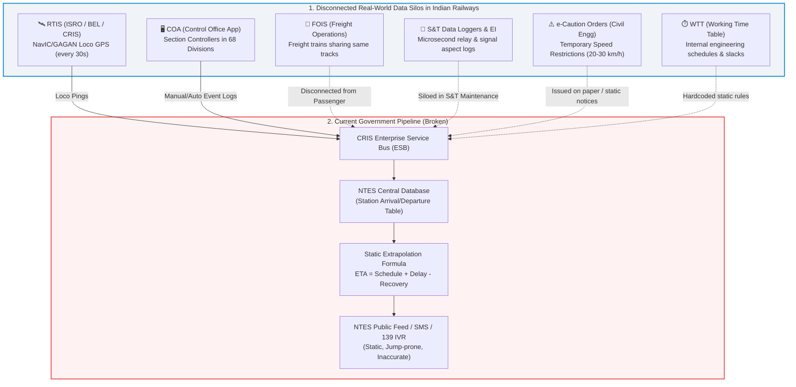
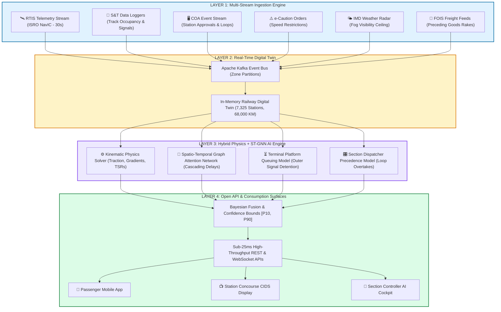

# GATI-SETU (गति-सेतु)
### Dynamic Forecast of Expected Time of Arrival (ETA) for Coaching Trains
**Smart India Hackathon (SIH) 2026 | Problem Statement ID: 26028**  
**Ministry of Railways | Category: Software | Theme: Smart Automation**

---


## 1. Executive Summary & Problem Context

Indian Railways operates one of the largest and most complex rail networks on earth, running over **13,500 passenger trains** and **9,000+ freight trains** daily across **7,325 stations** spanning **68,000+ route kilometers**. Despite massive digital modernization (including GPS-based locomotive tracking via RTIS), arrival time prediction remains fundamentally broken. 

The core issue: **The current National Train Enquiry System (NTES) does not forecast ETA—it merely recalculates a static formula.**

$$\text{NTES ETA} = \text{Current Time} + \sum \text{Scheduled Sectional Running Time} - \text{Scheduled Timetable Recovery Buffer}$$

When a train encounters real-world dynamic friction—such as a preceding goods train crawling in the block section ahead, a 30 km/h Temporary Speed Restriction (TSR), a yellow signal sequence, single-line crossing wait, or platform unavailability at the destination yard throat—the static formula breaks down entirely. Passengers wait at platforms looking at displays saying *"Arriving in 5 mins"* while their train sits stationary at the outer signal for 45 minutes.

This document presents a comprehensive government-level autopsy of existing systems and proposes **GATI-SETU (Graph-Augmented Transit Intelligence for Indian Railways)**: a Physics-Informed Spatio-Temporal Graph Neural Network (PI-STGNN) with real-time digital twin simulation.

> **Simple Analogy:** Imagine you ordered food for delivery. The restaurant looks at a chart written a year ago and says: *"It will reach you at 8:00 PM."* They did not look outside. Right now, there is a storm, the road is closed for repair, and the driver is stuck behind a slow truck. The food actually arrives at 8:45 PM. Indian Railways today mostly tells you arrival times using an old printed timetable + current delay, without properly looking at what is physically happening on the tracks ahead.

---

## 👥 2. Who is this System Built For?

According to the official Ministry of Railways problem statement, this system serves **3 primary user groups**:

```
┌──────────────────────────────────────────────────────────────────────────────────────────────────┐
│                                    3 PRIMARY STAKEHOLDER GROUPS                                  │
├──────────────────────────────┬─────────────────────────────────┬─────────────────────────────────┤
│ 1. The Passenger             │ 2. Station Staff & Masters      │ 3. Section Controllers          │
├──────────────────────────────┼─────────────────────────────────┼─────────────────────────────────┤
│ • Accessed via Mobile Apps   │ • Accessed via Concourse CIDS   │ • Accessed via Divisional COA   │
│   (NTES, IRCTC, WIMT)        │   Electronic Display Boards     │   Control Room Dashboards       │
│ • Needs honest, realistic    │ • Needs platform readiness      │ • Needs real-time track map     │
│   arrival times & windows    │   countdowns & early warnings   │ • Needs AI precedence guidance  │
│ • Needs plain-English delay  │ • Manages cleaning crews,       │   (which train to loop, which   │
│   reasons (e.g. outer hold)  │   water filling & crowd rushes  │   to run on green corridor)     │
└──────────────────────────────┴─────────────────────────────────┴─────────────────────────────────┘
```

---

## 🔬 3. Government Ecosystem Audit: Existing Railway Systems

To build a solution that works for Indian Railways, we must first map the real operational infrastructure managed by the **Centre for Railway Information Systems (CRIS)** and the **Ministry of Railways (MoR)**:



### Key Government Systems Analyzed:

1. **RTIS (Real-Time Train Information System)**:
   - Built jointly by CRIS, ISRO (Space Applications Centre, Ahmedabad), and Bharat Electronics Limited (BEL).
   - Deployed on **8,500+ locomotives** using dual GSAT MSS (NavIC/GAGAN) satellite transceivers and 4G/GPRS fallback.
   - Pings speed and GPS coordinates every **30 seconds** directly to central servers without manual station master action.
   - *Limitation*: RTIS provides high-precision **historical & current location**, but **zero forward-looking prediction**. Knowing where a train is *now* does not tell you if the signal 3 km ahead will turn red.

2. **COA (Control Office Application)**:
   - Used by Section Controllers across **68 railway divisions** to dispatch trains on time-distance graphs (control charts).
   - Controllers manually prioritize trains (e.g., pulling a passenger train into a loop line to let a Vande Bharat or Rajdhani overtake).
   - *Limitation*: Controller decisions are tactical and discretionary; they are not fed into any predictive algorithm before execution.

3. **NTES (National Train Enquiry System)**:
   - The primary passenger-facing system (`enquiry.indianrail.gov.in`).
   - Architected as an OLTP (On-Line Transaction Processing) database designed to answer *"What is the schedule of Train X?"*.
   - Uses linear speed-distance math adjusted by manual station logs.

4. **S&T Data Loggers & Electronic Interlocking (EI)**:
   - Known as the railway's "Black Box", installed at station relay rooms.
   - Records every relay pickup, track circuit occupancy, point motor alignment, and signal aspect change with microsecond timestamps.
   - *Limitation*: Primarily utilized post-hoc by safety commissioners for accident investigations and asset maintenance. This high-density signal feed is **never ingested into the public ETA engine in real-time**.

5. **e-Caution Order & TSR System**:
   - Manages Temporary Speed Restrictions (e.g., "Track work at KM 412/10: max speed 20 km/h for 800m").
   - Issued to Loco Pilots as caution notices at notice stations.
   - *Limitation*: Not dynamically parsed into NTES sectional travel time calculations.

6. **FOIS (Freight Operations Information System)**:
   - Tracks over 9,000 freight rakes daily. Freight trains travel at lower speeds (40–60 km/h) and share the exact same track infrastructure as high-speed coaching trains (70%+ of the Golden Quadrilateral runs mixed traffic).
   - *Limitation*: Completely segregated from the passenger NTES calculation. NTES assumes the track ahead is empty.

7. **WTT (Working Time Table)**:
   - Contains operational sectional running times, maximum permissible speeds, and built-in engineering recovery times (15 to 45 mins).
   - *Limitation*: Timetables are static and do not adapt when high-density congestion invalidates planned schedules.

---

## ☠️ 4. The Autopsy: Why Previous Systems Always Failed

Based on **CAG Audit Report No. 32 of 2016**, **CAG 2018–19 Punctuality Audit**, and railway operational research:

```
┌────────────────────────────────────────────────────────────────────────────────────────┐
│                        6 STRUCTURAL FAILURE MODES OF CURRENT ETA                       │
├────────────────────────────────┬───────────────────────────────────────────────────────┤
│ 1. The Isolated Train Fallacy  │ Assumes train moves in a vacuum; ignores block section│
│    (Network Headway Blindness) │ occupancy and slow freight trains ahead on same line. │
├────────────────────────────────┼───────────────────────────────────────────────────────┤
│ 2. The Recovery Time Paradox   │ Deducts built-in timetable buffer linearly even when  │
│    (Compounding Non-Linearity) │ a delayed train has lost its scheduled priority path. │
├────────────────────────────────┼───────────────────────────────────────────────────────┤
│ 3. Outer Signal Stabling       │ Major terminal bottlenecks (throat yards/platforms)   │
│    (Terminal Yard Throat Trap) │ trap trains 1-2 km out, while NTES says "Arriving".   │
├────────────────────────────────┼───────────────────────────────────────────────────────┤
│ 4. Unmodeled Dispatch Politics │ Section controllers loop lower-priority trains to let │
│    (Precedence & Overtakes)    │ premium rakes pass; NTES has zero visibility into it. │
├────────────────────────────────┼───────────────────────────────────────────────────────┤
│ 5. Caution Order / TSR Blind-  │ Track maintenance speed restrictions (20 km/h caution)│
│    spots & Weather Ceilings    │ and Fog Safe Rules (60 km/h max) ignored in math.     │
├────────────────────────────────┼───────────────────────────────────────────────────────┤
│ 6. Legacy OLTP Database vs     │ NTES queries static rows; real-time dynamic ETA needs │
│    Real-Time Streaming Graph   │ Kafka streaming + Graph Neural Network simulation.    │
└────────────────────────────────┴───────────────────────────────────────────────────────┘
```

---

## 🏗️ 5. GATI-SETU Solution Architecture



---

## 🖥️ 6. The 4 Interactive Surfaces (Screenshots)

The system is fully implemented and tested on the 786 KM Golden Quadrilateral trunk line (**New Delhi $\leftrightarrow$ Kanpur Central $\leftrightarrow$ Prayagraj $\leftrightarrow$ Pt. Deen Dayal Upadhyay Jn**):

### Surface 1: Passenger Experience Hub
* **Side-by-Side Comparison:** Shows the legacy NTES prediction vs. GATI-SETU dynamic prediction, highlighting the exact error discrepancy.
* **Explainable Delay Badges:** Informs passengers *why* their train is delayed (e.g. ⚠️ 30 km/h Caution Order at Panki, 🛑 Kanpur Outer Signal Stabling due to Platform 1 blockage, 🚦 Trailing Coal Freight 3.5 km ahead).
* **90% Confidence Window:** Displays realistic arrival spreads (e.g. `22:19 [22:19 – 22:21, 90% Confidence]`).
* **Live Speed & RTIS Telemetry:** Real-time NavIC satellite telemetry and speedometer.


---

### Surface 2: Station Concourse Display (CIDS)
* **Concourse Electronic Arrival Board:** Matches Indian Railways station standards with real-time arrivals, dynamic ETAs, platform assignments, and operational remarks.
* **Platform Readiness Grid:** Real-time state of Platforms 1 through 10 at Kanpur Central (CNB).
* **Outer Signal Hold Warning:** Notifies station masters and crowds when a train is stabled outside the station to prevent concourse stampedes.


---

### Surface 3: Section Controller AI Dispatch Cockpit
* **Interactive What-If Disruption Lab:** Toggle 30 km/h caution orders, winter fog ceilings, or platform blockages in real time to observe dynamic recomputation.
* **AI Precedence Advisor:** Detects inter-train conflicts (e.g. Shiv Ganga Express trailing slow coal freight) and offers 1-click execution: *"Loop BOXN-8422 at Etawah Jn Loop 2 to save 19 minutes"*.
* **Digital Twin Track Visualizer:** Displays block sections and live train positions across the 786 KM corridor.


---

### Surface 4: Government Audit & Technical Dossier
* **Autopsy of the 6 Structural Failures:** Rigorous breakdown based on CAG Audit Reports.
* **Mathematical Formulations:** Details the Kinematic Traction Equations and Spatio-Temporal Graph Attention weights.
* **OpenAPI 3.1 REST API Contracts:** Ready for immediate integration into the CRIS Enterprise Service Bus.


---

## 📊 7. Comparative Benchmark Matrix

| Capability | Current NTES (Government) | Commercial Apps (Where Is My Train / RailYatri) | GATI-SETU (Our Innovation) |
| :--- | :---: | :---: | :---: |
| **Prediction Engine** | Static timetable subtraction formula | Historical regression + cell tower GPS | Physics Kinematics + Spatio-Temporal Graph Attention (ST-GAT) |
| **Telemetry Feed** | RTIS GPS (30s) / Station Master log | Crowdsourced cell tower pings + scraped NTES | Direct RTIS NavIC/GAGAN + S&T Relay Data Loggers |
| **Preceding Train Headway** | ❌ None (assumes empty track) | ❌ None (no freight or track occupancy data) | ✅ Fully modeled via block section occupancy & FOIS integration |
| **Temporary Speed Restrictions (TSR)** | ❌ Ignored | ❌ Ignored | ✅ Ingested dynamically from e-Caution order database |
| **Single-Line Crossing & Precedence** | ❌ Ignored (assumes free run) | ⚠️ Partial (historical average stop heuristic) | ✅ Modeled via Dispatcher Priority Hierarchy & Track Graph |
| **Outer Signal Yard Bottleneck** | ❌ Fails (claims "Arriving" while stopped) | ❌ Fails (reports stopped with no reason) | ✅ Modeled via Terminal Platform Queuing State Machine |
| **Fog / Weather Speed Rules** | ❌ Blanket delay notice only | ❌ Ignored in transit math | ✅ Automatic Fog Safe Device speed ceiling enforcement (60 km/h) |
| **Output Type** | Single static point (frequently wrong) | Single point + generic delay text | Probabilistic Expected ETA + 90% Confidence Window |
| **Railway Operations Integration** | Read-only public database | Third-party web scraping / public API | Bi-directional: feeds NTES, Station CIDS, and COA Controllers |
| **Query Response Latency** | High during peak holiday surges | Third-party cloud dependent | Kafka + In-Memory Graph + Redis Cache (<25ms) |

---

## 💻 8. Technology Stack

```
┌──────────────────────────────┬───────────────────────────────────────────────────────────────────┐
│ Layer                        │ Technologies & Libraries                                          │
├──────────────────────────────┼───────────────────────────────────────────────────────────────────┤
│ Passenger Native Mobile App  │ React Native / Capacitor Android · Jetpack Compose UI · SQLite    │
├──────────────────────────────┼───────────────────────────────────────────────────────────────────┤
│ Operations Web Console       │ React 19 · Vite 8 · Tailwind CSS v4 · Lucide Icons · Sonner       │
├──────────────────────────────┼───────────────────────────────────────────────────────────────────┤
│ Ingestion & Event Streaming  │ Apache Kafka · Apache Flink · Redis In-Memory Cache · PostgreSQL  │
├──────────────────────────────┼───────────────────────────────────────────────────────────────────┤
│ AI & Graph Neural Network    │ PyTorch Geometric (ST-GAT) · NetworkX · Physics Kinematics Engine │
├──────────────────────────────┼───────────────────────────────────────────────────────────────────┤
│ Telemetry & Hardware Feeds   │ ISRO NavIC / GAGAN GPS NMEA · CRIS RTIS Protocol · S&T Data Logger│
└──────────────────────────────┴───────────────────────────────────────────────────────────────────┘
```

---

## 🚀 9. Quickstart & Local Setup

### Prerequisites
- Node.js (v18 or higher)
- npm (v9 or higher)

### Installation
```bash
# 1. Clone repository
git clone https://github.com/tejuas98/Railway-.git
cd Railway-

# 2. Install dependencies
npm install

# 3. Start development server
npm run dev
```

The application will launch on **`http://localhost:5180/`**.

### Direct Surface Navigation
You can jump directly to any surface using URL query parameters:
- **Passenger Tracker:** `http://localhost:5180/?tab=passenger`
- **Station Concourse Display:** `http://localhost:5180/?tab=station`
- **Section Controller Cockpit:** `http://localhost:5180/?tab=controller`
- **Audit & Technical Dossier:** `http://localhost:5180/?tab=dossier`

---

## 📜 10. Documentation Index

- [01. Government Ecosystem Audit & Failure Autopsy](docs/01_RESEARCH_AND_FAILURE_AUTOPSY.md)
- [02. Mathematical Formulations & ST-GNN Architecture](docs/02_MATHEMATICAL_FORMULATION.md)
- [03. REST & WebSocket API Specifications](docs/03_API_SPECIFICATIONS.md)

---

*Developed for the Ministry of Railways, Government of India · Smart India Hackathon (SIH) 2026*
