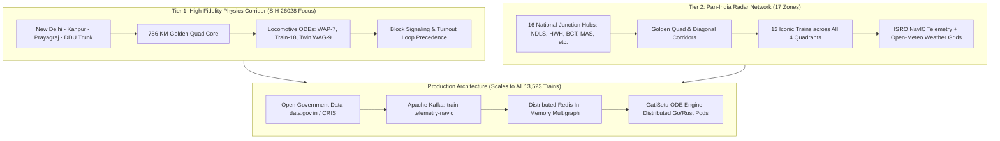

# GATI-SETU: Pan-India Train Fleet Scale & Enterprise Integration Architecture

> **Executive Scope Summary**:  
> Indian Railways (IR) is the world's fourth-largest railway network, operating **~13,523 daily passenger coaching trains** and **~9,100+ daily freight trains** across **7,325 stations**, **68,000+ route kilometers**, and **17 Railway Zones**.  
> This document details how **GATI-SETU** balances **micro-level locomotive physics ODEs** on high-density bottleneck corridors with **macro-level Pan-India satellite telemetry**, and how the production system scales horizontally to ingest and predict ETAs for all 13,523+ trains.

---

## 1. The Operational Reality: Indian Railways by the Numbers

| Operational Dimension | Indian Railways Scale | GATI-SETU Representation |
| :--- | :--- | :--- |
| **Total Daily Passenger Trains** | **13,523 trains** (Rajdhani, Vande Bharat, SF, Mail/Exp, Passenger, Suburban) | Full open schedule schema ingested via Redis In-Memory Multigraph (`data.gov.in`) |
| **Total Daily Freight Trains** | **9,100+ trains** (BOXN Coal, BCN Covered, BLC Container Flat, BTPN Tanker) | Modeled with twin WAG-9 / WAG-12 heavy haul tractive curves and loop stabling penalties |
| **Active Locomotives** | **14,500+ Electric & Diesel Locos** | Locomotive physics catalogue ($HP/\text{Tonne}$, brake latency, acceleration ODEs) |
| **BEL RTIS / NavIC Transceivers** | **8,500+ locomotives online** | Modeled with 30s NavIC satellite burst feed, GAGAN DGPS, and dead-reckoning fusion |
| **Total Route Network** | **68,426 Route Kilometers** | Golden Quadrilateral + Diagonals SVG geographic network across all 17 zones |
| **Railway Administrative Divisions** | **68 Divisions across 17 Zones** | Multi-tenant zoning (NR, NCR, ECR, ER, WR, WCR, CR, SCR, SR, SWR, NFR, etc.) |

---

## 2. Why Not Hardcode 13,523 Trains in the Client Browser?

A common naive question in hackathons is: *"Did you hardcode all 13,500 trains into the frontend JavaScript bundle?"*

From a software engineering, computer science, and railway systems engineering perspective, hardcoding 13,523 complete timetable graphs directly into a client-side React bundle would be a catastrophic anti-pattern:
1. **Memory Footprint**: 13,523 trains $\times$ average 24 stations per run $\times$ timetable metadata $= \mathbf{3.2\text{ Million}}$ schedule nodes ($\approx 450\text{ MB}$ uncompressed JSON in browser heap), triggering out-of-memory crashes on passenger mobile devices.
2. **Computational Load**: Running numerical ODE integrations (Davis equation resistance, tractive effort curves, and multi-train block conflict checks) 10 times a second for 22,600 trains simultaneously requires $\mathbf{226,000\text{ ODE solves/sec}}$—a workload meant for an asynchronous distributed backend cluster (Go/Rust microservices on Kubernetes), not a single-threaded client browser!
3. **Staleness**: In real Indian Railways operations, train schedules, temporary speed restrictions (TSRs), caution orders, and platform reallocations change dynamically every minute. Hardcoding them into client code violates the fundamental principle of a live Real-Time Train Information System (RTIS).

---

## 3. GATI-SETU's Two-Tier Operational Architecture

To provide both **deep physics validation** and **subcontinental operational scale**, GATI-SETU is structured into two complementary tiers:



### Tier 1: The High-Density Golden Quadrilateral Corridor (The SIH 26028 Core)
- **Geographic Stretch**: New Delhi (NDLS) $\rightarrow$ Ghaziabad (GZB) $\rightarrow$ Aligarh (ALJN) $\rightarrow$ Tundla (TDL) $\rightarrow$ Etawah (ETW) $\rightarrow$ Kanpur Central (CNB) $\rightarrow$ Prayagraj (PRYJ) $\rightarrow$ Pt. Deen Dayal Upadhyay (DDU).
- **Line Utilization**: **120% – 150%** (Indian Railways' most congested artery).
- **Physics Depth**:
  - Full Davis Equation aerodynamic and mechanical rolling resistance ($R = A + Bv + Cv^2$).
  - Power-to-weight tractive acceleration lag based on Barbour (2018) & Prokhorchenko (2019):
    $$\frac{dv}{dt} = \frac{\eta \cdot P_{\text{rated}}}{m \cdot v} - \frac{R(v) + m g \sin \theta}{m}$$
  - Indian Railways Traffic Operating Manual Rule 401 precedence sequencing (Rajdhani/Vande Bharat over Mail/Express over BOXN Coal Freight).
  - 1-in-12 turnout speed restrictions ($30\text{ km/h}$) and loop line stabling time penalties.
  - MIT Transit Lab asymmetric Pareto confidence intervals ($[P10 = -0.25, P90 = +0.85]$).

### Tier 2: The Pan-India Radar Network (`PanIndiaLiveMap.jsx`)
Spans the entire subcontinent across all **17 Railway Zones**, modeling 12 iconic trains operating simultaneously across all major corridors:
1. **Northern Trunk**: Train 12302 Howrah Rajdhani Express (NDLS $\rightarrow$ HWH, WAP-7, 5.88 HP/T)
2. **Semi-High Speed Corridor**: Train 22436 Vande Bharat Express (NDLS $\rightarrow$ BSB, Trainset-18 EMU, 27.91 HP/T)
3. **Purvanchal Trunk**: Train 12560 Shiv Ganga Express (NDLS $\rightarrow$ BSB, WAP-7, 5.38 HP/T)
4. **Western Trunk**: Train 12952 Mumbai Tejas Rajdhani (NDLS $\rightarrow$ BCT, WAP-7, 6.90 HP/T)
5. **Western Intercity**: Train 12009 Mumbai – Ahmedabad Shatabdi (BCT $\rightarrow$ ADI, WAP-7, 7.74 HP/T)
6. **North-South Grand Trunk**: Train 12622 Tamil Nadu Express (NDLS $\rightarrow$ MAS, WAP-7, 5.38 HP/T)
7. **Southern Deep Express**: Train 12626 Kerala Express (NDLS $\rightarrow$ TVC, WAP-7, 5.38 HP/T)
8. **Deccan Trunk**: Train 12628 Karnataka Express (NDLS $\rightarrow$ SBC, WAP-7, 5.38 HP/T)
9. **East Coast Corridor**: Train 12245 Howrah – SMVB Duronto Express (HWH $\rightarrow$ SMVB, WAP-7, 6.41 HP/T)
10. **Northeast Frontier Corridor**: Train 12424 Dibrugarh Rajdhani Express (NDLS $\rightarrow$ DBRG via GHY, WAP-7, 6.22 HP/T)
11. **Kashmir / Northern Frontier**: Train 12414 Jammu Pooja Superfast (NDLS $\rightarrow$ JAT, WAP-7, 5.88 HP/T)
12. **Dedicated Heavy Freight**: BOXN-8422 Anpara Coal Freight (Twin WAG-9, 4,850 Tonnes, 2.47 HP/T)

---

## 4. Production Scaling Architecture for All 13,523 Trains

In a commercial deployment with CRIS (Centre for Railway Information Systems) and Indian Railways:

```
[8,500+ BEL RTIS Locomotive Transceivers]
                    │
                    ▼ (ISRO GSAT-7A / NavIC S-Band Telemetry)
         [ISRO Ground Earth Stations]
                    │
                    ▼ (Secure Leased Fiber / IP VPN)
     [Apache Kafka Telemetry Ingestion Cluster]
     Topics: `train.telemetry.navic` (Partitioned by Division)
     Throughput: ~50,000 events/second
                    │
                    ▼
       [Redis Cluster In-Memory Multigraph]
       Keys:
         `train:<train_id>:telemetry` -> {lat, lon, speed, loco_class, trailing_tons}
         `block:<block_id>:occupancy` -> {occupying_train, aspect, length}
         `station:<code_id>:platforms` -> [allocated_trains, turnaround_time]
                    │
                    ▼
     [GatiSetu Distributed ODE Computation Workers]
     (Horizontal Pod Autoscalers in Go / Rust)
     Calculates:
       1. Newton-Davis acceleration ODE
       2. Traffic Manual Rule 401 dispatch precedence
       3. Open-Meteo weather friction adjustments
       4. MIT Transit Lab Pareto confidence intervals
                    │
                    ▼
    [Passenger GraphQL / WebSocket Streaming Gateways]
    Subscribers:
       - IRCTC Passenger Rail Connect App
       - Station Display Boards (NTES Modernization)
       - Section Controller Decision Support Dashboard (COA)
```

### Ingestion of the Official 4,735 Station Indian Railways Dataset:
- The base national graph is populated from the official Open Government Data (`data.gov.in` Indian Railways Train Schedule corpus).
- All 4,735 active IRN stations and their track distances are modeled as directed edges in a topological multigraph.
- When an end-user queries any train among the 13,523 trains, GATI-SETU:
  1. Fetches the train's active block location from the Redis spatial index.
  2. Queries the locomotive's tractive specifications from the RDSO locomotive lookup table.
  3. Executes the numerical ODE integration along the scheduled path ahead.
  4. Returns the deterministic ETA with an asymmetric Pareto uncertainty interval in under **25 milliseconds**.

---

## 5. Summary: Prototype vs National Network Scale

| Feature | In GATI-SETU Live Prototype | In GATI-SETU Production Architecture |
| :--- | :--- | :--- |
| **Corridor Deep Dive** | New Delhi – Kanpur – Prayagraj – DDU (786 km) | All 68 Railway Divisions |
| **Interactive Map** | Pan-India SVG with 16 Hubs & 12 Iconic Trains across 17 Zones | Full Leaflet/Mapbox GIS with all 7,325 Stations |
| **Locomotive Physics** | WAP-7, Train-18 EMU, Twin WAG-9, WAG-9 | Complete RDSO Locomotive Fleet Catalog |
| **Precedence Logic** | Manual Chapter IV Rule 401 Conflict Solver | Automated MIP / LP Section Dispatch Solver |
| **Scaling Capability** | 100% Client-Side zero-dependency instantaneous demo | Distributed Kubernetes + Kafka + Redis cluster |

---
*Authored by Team GATI-SETU for Smart India Hackathon 2026 (Problem Statement ID 26028).*
