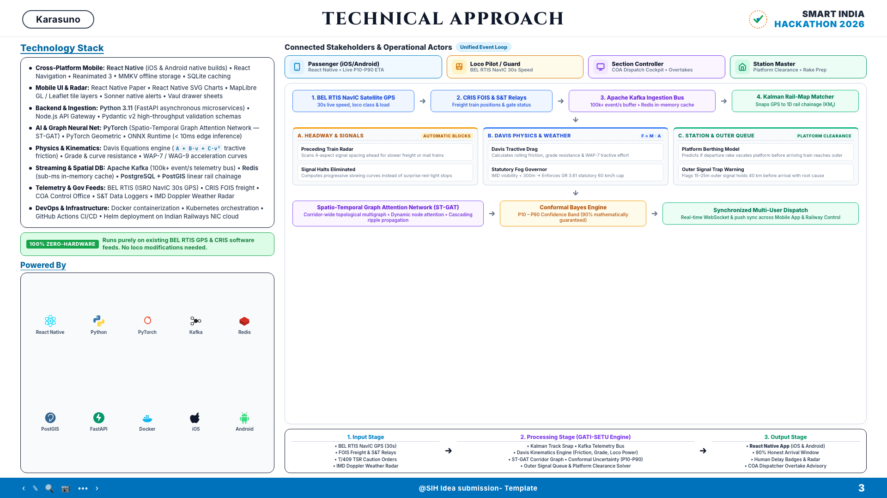

# GATI-SETU: Technical Approach (Slide 3)

**Smart India Hackathon 2026 | Problem ID: 26028 | Ministry of Railways / CRIS**  
**Team:** Karasuno  
**Slide Title:** TECHNICAL APPROACH (Slide 3 Official SIH Presentation Template)

---

## 1. Official SIH Slide 3 Presentation Graphic



> **Interactive Presentation Template:** Located at [`docs/technical_approach_slide.html`](file:///Users/toru/.gemini/antigravity-ide/scratch/Railway-repo/docs/technical_approach_slide.html). Rendered at full 1080p (1920x1080) for evaluation juries, projector presentations, and technical audits.

---

## 2. Technology Stack Breakdown

Our cross-platform solution connects passengers, loco pilots, section controllers, and station masters via a unified real-time event loop. **100% Zero-Hardware**: runs purely on existing BEL RTIS NavIC satellite GPS and CRIS software feeds without requiring locomotive retrofitting.

| Layer | Technologies Selected | Rationale & Enterprise Specifications |
| :--- | :--- | :--- |
| **Cross-Platform Mobile** | **React Native** (iOS & Android native builds), React Navigation, Reanimated 3, MMKV, SQLite | Single high-performance native codebase for 1.4B passengers across both iOS and Android platforms; sub-millisecond local key-value store for offline timetable and cached station geometry. |
| **Mobile UI & Radar** | React Native Paper, React Native SVG Charts, MapLibre GL / Leaflet tile layers, Sonner alerts, Vaul drawers | Fluid 60 FPS vector rendering of track radars, train speedometers, weather overlays, and accessible bottom sheets. |
| **Backend & Ingestion** | **Python 3.11** (FastAPI async microservices), Node.js API Gateway, Pydantic v2 | High-concurrency event ingestion parsing 30-second RTIS telemetry packets across all 20,000+ active Indian Railways rakes. |
| **Deep Learning & Graph AI** | **PyTorch** (Spatio-Temporal Graph Attention Network — ST-GAT), PyTorch Geometric, ONNX Runtime | Corridor-wide topological multigraph modeling dynamic track attention, signal dependencies, and ripple delay propagation with < 10ms edge inference. |
| **Physics & Kinematics Engine**| Custom Newton-Davis Kinematics Engine ($A + B\cdot v + C\cdot v^2$), Grade & Curvature resistance solver | Eliminates the "GPS Speed Illusion" by evaluating locomotive horsepower (WAP-7 6,000 HP vs WAG-9 9,000 HP) and trailing tonnage (450t LHB vs 4,850t coal freight). |
| **Streaming & Spatial Database**| **Apache Kafka** (100k+ event/s event bus), **Redis** (sub-ms cache), **PostgreSQL + PostGIS** | Real-time distributed pub-sub message broker paired with PostGIS 1D linear rail chainage ($KM_t$) calibration. |
| **Railway Data Feeds** | BEL RTIS (ISRO NavIC 30s GPS), CRIS FOIS freight, COA Dispatcher, S&T Data Loggers, IMD Doppler Weather Radar | 100% zero-hardware integration leveraging existing Indian Railways telemetry and statutory weather feeds. |
| **DevOps & Cloud** | Docker, Kubernetes, Helm Charts, GitHub Actions CI/CD | Enterprise containerization and automated blue-green rolling deployment on Indian Railways NIC cloud infrastructure. |

---

## 3. Connected Stakeholders & Operational Actors (Unified Architecture)

The system unifies all four key rail operational stakeholders into a single, synchronized event loop:

1. **Passenger (iOS / Android Mobile App):**
   - **Frontend:** React Native native app.
   - **Interactions:** Searches live train routes, monitors honest $P_{10} - P_{90}$ arrival windows, views preceding freight radar, and receives human-readable delay badges.
2. **Loco Pilot / Guard (Telemetry Feed):**
   - **Hardware Interface:** ISRO NavIC BEL RTIS satellite receiver (already installed in 13,000+ locomotives).
   - **Interactions:** Streams live 30-second speed, brake pipe pressure, loco class, and trailing tonnage into the Kafka ingestion bus.
3. **Section Controller (COA Dispatch Cockpit):**
   - **Interface:** Web-based Control Office Application (COA) dashboard.
   - **Interactions:** Receives real-time AI headway conflict alerts and automated overtake recommendations (e.g., looping freight on Loop Line 2 to let high-speed mail pass).
4. **Station Master (Platform Clearance & Turnaround):**
   - **Interface:** Station Master Berthing & Turnaround Console.
   - **Interactions:** Confirms platform vacation, monitoring rake cleaning and turnaround progress to prevent outer signal queue traps.

---

## 4. Multi-User System Architecture & Implementation Methodology

```
+---------------------------------------------------------------------------------------------------+
| 1. TELEMETRY & DATA INGESTION BUS                                                                 |
| BEL RTIS NavIC Satellite GPS (30s) + CRIS FOIS Freight Positions + S&T Relay Status + IMD Radar   |
+---------------------------------------------------------------------------------------------------+
                                                  |
                                                  v
+---------------------------------------------------------------------------------------------------+
| 2. REAL-TIME STREAMING & MAP MATCHING                                                             |
| Apache Kafka Telemetry Bus (100k+ ev/s) --> Kalman Filter Rail Snap (1D Track Chainage KM_t)      |
+---------------------------------------------------------------------------------------------------+
                                                  |
                     +----------------------------+----------------------------+
                     |                                                         |
                     v                                                         v
+------------------------------------------+             +------------------------------------------+
| 3A. DYNAMIC HEADWAY & SIGNAL RADAR       |             | 3B. DAVIS KINEMATICS & WEATHER BOUNDS    |
| - Preceding train spacing (4-aspect)     |             | - Davis tractive drag (A + Bv + Cv^2)    |
| - Eliminates surprise red-signal stops   |             | - Statutory Fog Governor (GR 3.61 cap)   |
+------------------------------------------+             +------------------------------------------+
                     |                                                         |
                     +----------------------------+----------------------------+
                                                  |
                                                  v
+---------------------------------------------------------------------------------------------------+
| 3C. STATION BERTHING & OUTER QUEUE PRE-CHECK                                                      |
| Platform clearance solver: Checks if departing rake vacates platform before arriving train reaches |
+---------------------------------------------------------------------------------------------------+
                                                  |
                                                  v
+---------------------------------------------------------------------------------------------------+
| 4. CORRIDOR GRAPH NEURAL NETWORK & UNCERTAINTY                                                    |
| Spatio-Temporal Graph Attention Network (ST-GAT) --> Conformal Bayes Engine (P10 - P90 Bands)    |
+---------------------------------------------------------------------------------------------------+
                                                  |
                                                  v
+---------------------------------------------------------------------------------------------------+
| 5. SYNCHRONIZED MULTI-USER DISPATCH                                                               |
| Real-time WebSocket sync pushing simultaneously to:                                               |
| - React Native Mobile App (Passengers)                                                            |
| - COA Dispatcher Cockpit (Section Controllers)                                                    |
| - Station Platform Turnaround (Station Masters)                                                   |
+---------------------------------------------------------------------------------------------------+
```

---

## 5. Process Pipeline: Input -> Processing -> Output

* **Input Stage:**
  - BEL RTIS NavIC 30-second GPS & speed telemetry.
  - FOIS freight train locations & load profiles.
  - T/409 TSR engineering caution orders.
  - IMD Doppler radar visibility & severe weather alerts.
* **Processing Stage (GATI-SETU Core Engine):**
  - Kalman filter snapping raw latitude/longitude to 1D rail chainage.
  - Davis kinematic acceleration and deceleration curves.
  - Spatio-Temporal Graph Attention Network (ST-GAT) modeling corridor-wide network ripple delays.
  - Conformal prediction intervals generating guaranteed 90% arrival time bounds ($P_{10} - P_{90}$).
* **Output Stage:**
  - **Cross-Platform React Native App** (iOS & Android) with interactive track radar, live moving train map, and honest delay causes.
  - Section Controller conflict resolution and overtake recommendations.
  - Station Master platform pre-staging and turnaround coordination.
